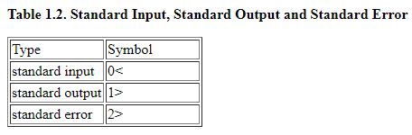
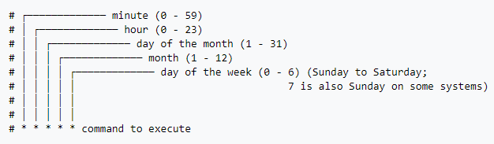

## Course Overview

- Moving from command-line to a Bash script
- Variables and data types in Bash scripting
- Control statements
- Functions and script automation

### Revisit

[Introduction to Shell](https://www.notion.so/Introduction-to-Shell-b70881d7ee0f4f0a9c70c3eeb6c90e10)

- Regex

### From Command Line to Bash Scripting

- Why Bash?
    - cmd allows us to write only line of code at  a time. Bash allows for multiple lines of code.
    - cmd is not reusable. Bash allow us to save the script and rerun again and again.
    - More advanced operations can be performed with bash
- What's Bash?

    > Bash means Bourne Again SHell. Bash (Bourne Again Shell ) is the free version of the Bourne shell distributed with Linux and GNU operating systems.

- How to write a bash script

    > In computing, a shebang is the character sequence consisting of the characters number sign and exclamation mark at the beginning of a script.

    `#!` Shebang/hash-bang followed by path to bash

    - Get location of bash - `which bash`
    - In case of windows its at `C:\Program Files (x86)\Gow\bin\bash.EXE`
    - To run a `.sh` file use `bash [filename.sh](http://filename.sh)` or `./filename.sh`
- sed
    - Stream Editor
    - Mainly used for text replacement
    - The `s,%,$,g` part of the command line is the `sed` command to execute. The `s` stands for substitute, the `,` characters are delimiters (other characters can be used; `/`, `:` and `@` are popular). The `%` is the pattern to match (here a literal percent sign) and the `$` is the second pattern to match (here a literal dollar sign). The `g` at the end means to `g`lobally replace on each line (otherwise it would only update the first match).

        ["sed" command in bash](https://stackoverflow.com/a/3984855/11899980)

- Standard streams & arguments
    - 3 STREAMS for bash programming
        - STDIN - A stream of data into the program
        - STDOUT - A stream of data out of the program
        - STDERR - Errors in our program

            

            

            [http://www.learnlinux.org.za/courses/build/shell-scripting/ch01s04.html](http://www.learnlinux.org.za/courses/build/shell-scripting/ch01s04.html)

    - STDIN vs ARGV
        - ARGV is the array of all the arguments passed to the program
        - Separated by spaces
        - Each argument can be accessed by its number position `$1` `$2` etc
        - To access all the arguments `$@` or `$*`
        - To access the number of arguments passed `$#`

        ```bash
        # Echo the first ARGV argument
        echo $1 

        # Cat all the files
        # Then pipe to grep using the first ARGV argument
        # Then write out to a named csv using the first ARGV argument
        cat hire_data/*.csv | grep "$1" > "$1".csv
        ```

        - Above function looks through all the csv files in the `hire_data` folder and filters out the data only for the city which is passed as an argument to the bash script.
        - Result is saved as a csv with city name as title

### Variables in Bash Scripting

- Basics of variables
    - Variable assignment is same as in other programming constructs
    - No space between variable and value `var1="value"`
    - Single quote,double quote and back tick are interpreted differently in bash
    - Content  inside the single quote is inferred literally
    - Double quote is same as single quote except `$` and `back ticks` are understood
    - Back tick is a powerful construct which shell within a shell

    ```bash
    var="value"
    #prints the content insidethe single quote >>> $var
    echo '$var'
    #interprets the value of the variable and prints the value >>> value
    echo "$var"

    #Backtick opens a line shell and adds the result to the call
    #Old method is back tick
    echo "The current date time is `date`"

    #New Method with Round brackets
    echo "The current date time is $(date)"

    ```

- Numeric Variables in Bash
    - `expr`
        - `expr 1 + 5` >>> 6
        - Limited to integer values
        - or use double paranthesis
        - `echo` `$(( 4 + 5))` uses `expr`so no decimal
    - `bc`
        - Basic Calculator
        - Opens a prompt to take inputs with expression
        - bc has an argument scale which allows us to specify the number of decimal places that is to be returned
        - `echo scale=3; 10 / 3 | bc` number of decimal places needed is 3 return 3.333

        ```bash
        # Get first ARGV into variable
        temp_f=$1

        # Subtract 32
        temp_f2=$(echo "scale=2; $temp_f - 32" | bc)

        # Multiply by 5/9 and print
        temp_c=$(echo "scale=2; $temp_f2 * 5 / 9" | bc)

        # Print the temp
        echo $temp_c
        ```

        ```bash
        # Create three variables from the temp data files' contents
        temp_a=$(cat temps/region_A)
        temp_b=$(cat temps/region_B)
        temp_c=$(cat temps/region_C)

        # Print out the three variables
        echo "The three temperatures were $temp_a, $temp_b, and $temp_c"
        ```

        - temps is a folder in which data for each region is dumped
        - Loading the region and storing its value in variable
        - `$()` ⇒ is like a back tick operation which provides an inline shell result of which was assigned to the variable in this case
- Arrays in Bash
    - Types of Array
        - Numerical Indexed array ⇒ Like python list , vectors in R
        - Associative array ⇒ Like Python dictionary, List in R
    - Numerical Indexed array
        - Declaring a array variable and add elements

            `declare -a numerical_array`

        - Declare and add elements at the same time

            `numerical_array=(1 2 3)`

            - Note the space in between the array elements and no spaces between equals

            ```bash
            array=(1 2 3)

            #Print elements of the array
            echo ${array[@]}

            #Length of array 
            echo ${#array[@]}

            #Access the first element of the array
            echo ${array[0]}

            #Change value of an array element
            array[0]=999

            echo ${array[@]} #Results in >>> (999 2 3)

            #Slice of an Array
            #array[@]:N:M         N=> Start element M=> Number of elements
            echo ${array[@]:1:2}

            #Appending elements to an array
            array+=(100)
            ```

            - Bash requires Curly braces to access array properties `@` prints all elements
            - `#` in front of the array returns the length of the array
            - Zero indexing for arrays
    - Associative Array
        - Like Dictionary in Python
        - Like list in R

        ```bash
        #Associative array
        #Dictionary in python key(string) value pairs
        declare -A city_details #Declare array
        city_details=([city]="NY" [pop]="14") #Add elements

        #Indexing into the array
        echo ${city_details[city]} # >>> NY

        #Declare and add elements in oneline

        declare -A city_details=([city]="NY" [pop]="14")

        #Return keys
        echo ${!city_details[@]}
        ```

        - Property to print just the key `!`
        - Declaring with `-A` . Note the upper case

### Control Statements in Bash

- IF Statement

    ```bash
    if [ CONDITION ]; then
    	# Some condition
    else
    	# Some other condition
    fi
    ```

    - Spaces between elements inside square bracket
    - Double parenthesis for numerical comparison
    - Square brackets can be used for numerical comparison with special flags

    ```bash
    ==
    !=
    >
    <

    #Special Flags
    -eq
    -ne
    -gt -ge
    -lt -le

    # AND
    &&

    #OR
    ||
    ```

    - File related flags

    [Bash Conditional Expressions (Bash Reference Manual)](https://www.gnu.org/software/bash/manual/html_node/Bash-Conditional-Expressions.html)

    ```bash
    x=10
    #Both methods can be used
    # if [$x>6] && [$x<12];then
    if [[ $x>6 && $x<12 ]];then
    	echo "True"
    fi
    ```

    - Can use cmd line function which return bool inside the conditional

    ```bash
    if grep -q 'Hello' words.txt; then
    	echo "Hello is inside"
    fi 
    ```

    - Program checks whether the word Hello is inside the word file.
    - Shell within shell construct can be used in the condition. rewriting above code

    ```bash
    if $( grep -q 'Hello' words.txt ); then
    	echo "Hello is inside"
    fi
    ```

    ```bash
    # Exercise-1
    # Extract Accuracy from first ARGV element
    accuracy=$(grep 'Accuracy' $1 | sed 's/.* //')

    # Conditionally move into good_models folder
    if [ $accuracy -gt 90 ]; then
        mv $1 good_models/
    fi

    # Conditionally move into bad_models folder
    if [ $accuracy -lt 90 ]; then
        mv $1 bad_models/
    fi
    ```

    ```bash
    #Exercise-2
    # Create variable from first ARGV element
    sfile=$1

    # Create an IF statement on first ARGV element's contents
    if grep -q 'SRVM_' $sfile && grep -q 'vpt' $sfile  ; then
    	# Move file if matched
    	mv $sfile good_logs/
    fi
    ```

- FOR loops

    ```bash
    for i in 1 2 3
    do
    	echo $i
    done

    #Or in one line
    for i in 1 2 3;do echo $i;done
    ```

    - Brace expansion for creating iterables in place
    - Expects Curly Braces

    ```bash
    for i in {1..5..2} # Start..Stop..Increment
    do
    	echo $i
    done
    ```

    - Three expression syntax similar to `C`

    ```bash
    for ((x=2;x<=4;x+=2))
    do
    	echo $x
    done
    ```

    - Glob Expansion
        - Pattern matching to create an iterable in place

        ```bash
        for book in books/*
        do
        	echo $book
        done
        ```

    - Shell within a shell to find a files set to loop over.

    ```bash
    for file in $(ls books/ | grep -i 'air')
    do
    	echo $file
    done
    ```

- WHILE Statement
    - define a variable
    - Check condition
    - Increment value of variable

    ```bash
    x=1
    while [ $x -le 3 ];
    do
    	echo $x
    	((x+=1))
    done
    ```

    ```bash
    # Create a FOR statement on files in directory
    for file in robs_files/*.py
    do  
        # Create IF statement using grep
        if grep -q 'RandomForestClassifier' $file ; then
            # Move wanted files to to_keep/ folder
            mv $file to_keep/
        fi
    done

    # Runs through all the python file and checks if the
    #code has RandomForestClassifier in it
    ```

- CASE Statement
    - Can be used in place of complex or multiple nested if statement constructs

    ```bash
    case 'STRINGVAR' in
    	PATTERN1)
    	COMMAND1;;
    	PATTERN2)
    	COMMAND2;;
    	*)
    	DEFAULT COMMAND;;
    esac
    ```

    ```bash
    # Create a CASE statement matching the first ARGV element
    case $1 in
      # Match on all weekdays
      Monday|Tuesday|Wednesday|Thursday|Friday)
      echo "It is a Weekday!";;
      # Match on all weekend days
      Saturday |Sunday)
      echo "It is a Weekend!";;
      # Create a default
      *) 
      echo "Not a day!";;
    esac
    ```

    ```bash
    # Use a FOR loop for each file in 'model_out/'
    for file in model_out/*
    do
        # Create a CASE statement for each file's contents
        case $(cat $file) in
          # Match on tree and non-tree models
          *"Random Forest"*|*GBM*|*XGBoost*)
          mv $file tree_models/ ;;
          *KNN*|*Logistic*)
          rm $file ;;
          # Create a default
          *) 
          echo "Unknown model in $file" ;;
        esac
    done
    ```

### Functions

- Basic Functions in Bash
    - Syntax

        ```bash
        function_name (){
        	#Do something
        	return something
        }

        # OR 
        function function_name (){      # IN this case round brackets are optional
        	#Do something
        	return something
        }

        #Function call
        function_name #Executes the function
        ```

        ```bash
        # Create function
        function upload_to_cloud () {
          # Loop through files with glob expansion
          for file in output_dir/*results.txt
          do
            # Echo that they are being uploaded
            echo "Uploading $file to cloud"
          done
        }

        # Call the function
        upload_to_cloud

        ```

        ```bash
        # Create function
        function what_day_is_it {

          # Parse the results of date
          current_day=$(date | cut -d " " -f1)

          # Echo the result
          echo $current_day
        }

        # Call the function
        what_day_is_it
        ```

    - By default all variables inside the function in bash is global scoped (accessible inside the function and its sub parts)
    - To define a local variable precede it with `local` command

    ```bash
    function capture(){
        echl "Print Something"
    }

    capture
    echo $?

    #>>>
    return.sh: line 2: echl: command not found
    **127**
    ```

- Arguments, Return Values and Scope
    - `return`  in bash is not for data it returns 0 if the function execution was successful and 1-255 if its a failure
    - `$?` is used to capture the return of the function

    ```bash
    #Shell within shell construct to capture the value returned by the function
    function convert_temp(){
    	echo $(echo "scale=2; ( $1 - 32 )* 5 / 9 " | bc )
    }
    convert=$(convert_temp 30)
    echo "30F in Celcius $convert C"
    ```

    ```bash
    # Create a function To calculate the percentage of two given numbers
    function return_percentage () {

      # Calculate the percentage using bc
      percent=$(echo "scale=4; $1 / $2" | bc)

      # Return the calculated percentage
      echo $percent
    }

    # Call the function with 456 and 632 and echo the result
    return_test=$(return_percentage 456 632)
    echo "456 out of 632 as a percent is $return_test"
    ```

    ```bash
    function sum_array () {
      local sum=0
      # Loop through, adding to base variable
      for number in "$@"
      do
        sum=$(echo "$sum + $number" | bc)
      done
      # Echo back the result
      echo $sum
      }
    # Call function with array
    test_array=(14 12 23.5 16 19.34)
    total=$(sum_array "${test_array[@]}")
    echo "The sum of the test array is $total"
    ```

- Scheduling script with Cron

    [crontab.guru - the cron schedule expression editor](https://crontab.guru/)

    > The software utility cron is a time-based job scheduler in Unix-like computer operating systems. Users that set up and maintain software environments use cron to schedule jobs (commands or shell scripts) to run periodically at fixed times, dates, or intervals. - Wikipedia

    - Named after greek word for time - `Chronos`
    - Cron Tab - List of all the cron jobs
      
        - Get the list of active tab `crontab -l`
- Cron Jobs - code for job execution in the cron tab
  
    
    
    Wikipedia - CRON - **m h dom mon dow command**
    
        ```bash
        # Create a schedule for 30 minutes past 2am every day
    30 2 * * *  bash script1.sh
    
        # Create a schedule for every 15, 30 and 45 minutes past the hour
    15,30,45 * * * * bash script2.sh
    
        # Create a schedule for 11.30pm on Sunday evening, every week
        30 23 * * 7 bash script3.sh
    ```
    
    - For specific time intervals `comma` is used `15,30,45 * * * *` Every 15th 30th and 45th minute.
    - `slash` for every increment `*/15 * * * *` runs every 15 minutes increment every hour every day of the month every month every day of the week
    - To Create a new job
        - `crontab -e` edit list of cronjob
        - add a line inside the crontab
        - Choice of Editor to open → During initial run only
        - Add the job save and exit out
    ```

### References

[101 Bash Commands and Tips for Beginners to Experts](https://dev.to/awwsmm/101-bash-commands-and-tips-for-beginners-to-experts-30je)

[Bash Scripting: Everything you need to know about Bash-shell programming](https://itnext.io/bash-scripting-everything-you-need-to-know-about-bash-shell-programming-cd08595f2fba)

[The Unix Shell](https://swcarpentry.github.io/shell-novice/)