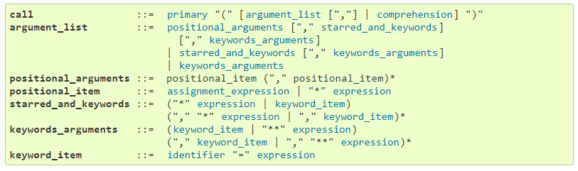

## Introduction to Python

- Python Who and When
    - Creator - Guido van Rossum
    - When - Late 1980's
    - Its a dynamically typed language → When the variables are declared the datatype is automatically inferred and can be changed to any other type during reassignment
- Ipython Who and When
    - Ipython - interactive python
    - Creator - Fernando Pérez
    - When - 2001
    - Instant result of execution
    - Part of broader Jupyter environment
- Variable
    - Sensible, case sensitive name
    - Datatypes
        - `int`
        - `float`
        - `str`
        - `bool`
    - `type(variable)` - returns the datatype of the object
    - Operation on Different data type == Different behavior

## Python Lists

- Creating List
    - Single name to the collection of values
    - Can contain different datatype inside it
    - Constructed using square brackets `[a,b,c]`
- Sub setting List
    - Index position starts at 0
    - Last element can be easily accessed by -1
    - To select the 4th element in the list we need to put index position 3
    - `list_name[3] >>> Element_4`
    - Selecting a range of list elements can be done through slicing. Returned element is also list. `list_name[start:end]` . Start inclusive and End excluding
    - `list_name[:end]` - Starts at index zero and goes upto but not including end index
    - `list_name[start:]` - Starts at start index and goes till the end of the list

- Manipulating List
    - Change, Insert, Delete list elements
    - While assigning a variable to the list it does not contain all the elements in the list instead it just contains the location of the first element
    - Suppose we assign the list variable to another variable memory is copied and any change in the new list will affect the old one
    - To explicitly create a copy of the list we have to use `y=list(x)` or `y=x[:]` or `y=x.copy()`
    - To know the location in which the list is stored use `id`
    - `append` - Appends a element to the last index position of the list
    - `count`  - Count the occurrence of an element in a list
    - `insert`  - Inserts a specified element in the index position
    - `reverse`  - Reverse the list
    - `clear`  - Removes all element inside the list
    - `extend`  - Adds multiple element to the list
    - `pop`  - Removes the last element from the list
    - `sort`  - Sorts based on the value in the list. Can be given `reverse=True` to reverse the list elements
    - `copy`  - Create a copy of list. Allocate new memory to the created list instead of just pointing the list
    - `index`  - Returns the index position of the element specified
    - `remove` - Removes the first occurrence of the element

## Functions and Packages

- Functions
    - Abstraction provided to the user → Implementation is not important to the user until it does what is needed
    - Piece of reusable code aimed at solving a particular task
    - `max()` , `round()` , `help` ,
    - Optional/keyword arguments should follow positional arguments in function definition

        

        Python docs

- Methods
    - Functions that belong to a particular python object
    - Based on the type of object methods under it will vary
    - Some methods will alter the object on which they are called on
- Packages
    - pip -  is a de facto standard package-management system used to install and manage software packages written in Python.
    - Once the package is installed we can access them in our script by importing it
    - One function form the package `from numpy import array`
    - Entire package `import numpy`
    - Entire package with alias `import numpy as np`

### Numpy

- Why
    - List doesn't support element wise calculation out of the box need to run a for loop through each element which is slow
    - Numpy provides faster implementation of element wise operation (Vectorized operation)
    - Homogenous element type should be there
    - If one element is of different type numpy will promote all other values to it and try to execute
    - int → float → string (Order of promotion of element)
- Subsetting
    - Subsetting is same as the list
    - Conditional subsetting can be done by creating boolean array which then can be subsetted on the original array to get the values
    - `arr[arr>3]`
- Indexing and Slicing
    - For a 2D array intersection of the rows and column specified are returned
    - `arr[r][c]` or `arr[r,c]`
    - Selecting multiple values of the rows and columns is like slicing
    - `arr[1:,:2]` here we select the second row and 0,1 column values
- Statistics

    `np.mean()`

    `np.median()`

    `np.sum()`

    `np.corrcoef()`

### References

[Python Function order of parsing arguments](https://community.dataquest.io/t/python-function-order-of-parsing-arguments/2846/8)

[6. Expressions - Python 3.8.3rc1 documentation](https://docs.python.org/3/reference/expressions.html#calls)