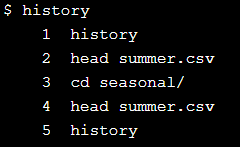
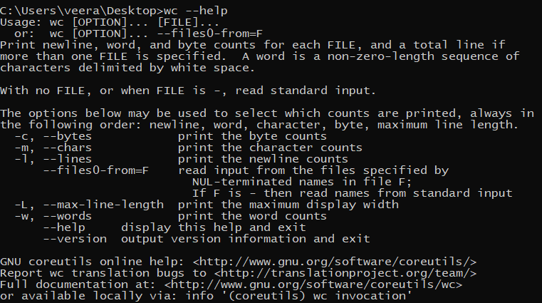

# Introduction to Shell


## What is OS? How is Shell related to graphical interface?

- OS is a level of abstraction which provides user with a clean user interface to interact and get output for the user.
- Main work of the OS is to manage other programs running by interacting with processors and storage devices.
- **Shell**  is the outer layer of interaction before OS was invented.
- It allowed users to type in command to make the computer do something.
- Modern day graphical interface and shell both give commands to the computer to execute an operation.
- Typing out commands to operate may seem weird at first, but operation may be coupled to automate repetitve tasks

- Find the current working directory

     `pwd` - print working directory

- Find the files in current working directory

    `ls` - listing

    ```bash
    ls /home
    # Displays the content of the folder home
    ```

- Absolute and Relative Path?
    - Path mentioned from root directory is Absolute
    - Path mentioned from the pwd is known as Relative
    - Absolute beings with /
    - Relative doesn't
- Move around the file system

    `cd` - change directory

    ```bash
    # Changes from current directory to Desktop
    cd Desktop

    # Move to parent directory => Up a level
    cd ..

    # Move to current directory => Here
    cd .

    # Move to Home directory
    cd ~

    #Similarly for list home directory
    ls ~
    ```

- Copy files
    - `cp` - copy

    ```bash
    # cp original duplicate
    cp summer.csv winter.csv

    # copy multiple files into a folder 
    cp summer.csv winter.csv backup
    ```

- Moving Files

    `mv` - move

    - Syntax same as cp
    - Renaming file can be done by moving the file from pwd to the same pwd with different name
    - If a file already exists with the same name it will replaced
    - Use interactive method to avoid such behavior
- Deleting files

    `rm` - remove

    - syntax same as cp and mv
    - Files deleted using rm doesn't go to recycle bin. its permanently deleted
- Deleting Folders
    - `rm` - removes files - gives error on directory deletion
    - `rmdir` - removes dir when dir is empty or
    - **`rm -r`** for  removing directory
- Make directory

    `mkdir` - make directory

- Print Contents of the file

    `cat` - concatenate

    - accepts multiple file names and prints them one after the other
    - Prints the entire content of the file which may be not good for large files

    `less`

    - prints one page at a time
    - this also accepts multiple file names prints first files first page as default
    - to move to next page of the same file `spacebar`  is used
    - to move to the next file `:n`
    - to move to the previous file `:p`
    - to quit from printing `:q`

- Look at the start of the file

    `head` 

    - by default it prints 10 rows of data
    - similar to pandas df.head() which prints 5 rows by default
- Control the ouput of the command with flag

    `head -n 3 filename.txt` 

    - prints first 3 lines of the file
    - -n means "number of lines"
- Display all the files and directories

    `ls -R`

    -R means recursive

- Get help in shell

    `man head`

    - displays the help for head command
    - man stands for manual
    - man automatically invokes less.. meaning it displays only one page of the help for the command
- Control the number of rows displayed

    `head` - prints the top 10 rows of the file by default

    `tail` - prints the bottom 10 rows of teh file by default

    `tail -n +5`  prints everything to the end of the file leaving the first five rows

- Select Columns?

    `cut —help`or `man cut`

    - limit the number of columns that is needed to be printed
    - we have to specify the fields or variables that we want and the delimited by which the file is separated

    `cut -f 2-5,8 -d , file.csv`

    - `-f` select the column
    - `-d` delimiter by which the data is separated
    - Above command selects column 2 to 5 and column 8 which is separated by comma in the file name file.csv
    - Adding space after the flag is not compulsory
- Easy way to repeat commands
    - up-arrow key displays the previously executed code
    - `history` will return numbered commands that was previously executed

        

    - To repeat the 10th command for example we can run `!55`
- Select Lines containing specific values?

    `grep word filenames` 

    - can be used for pattern search
    - `-c`: print a count of matching lines rather than the lines themselves
    - `-h`: do *not* print the names of files when searching multiple files
    - `-i`: ignore case (e.g., treat "Regression" and "regression" as matches)
    - `-l`: print the names of files that contain matches, not the matches
    - `-n`: print line numbers for matching lines
    - `-v`: invert the match, i.e., only show lines that *don't* match
- Storing command output in a file

    `command > output file` 

    '>' is  known as redirection command

- Commands output as an input?

    ```
    head -n 5 seasonal/winter.csv > top.csv
    tail -n 3 top.csv
    ```

    - for selecting 3-5 rows of a data
- Better ways to combine commands?
    - We can create powerfull data manipulation using pipe operator

    pipe operator for combining commands

    `head -n 5 seasonal/summer.csv | tail -n 3`

    Output of the first command on the left to be past to the one on the right

- Count the records in a file?

    `wc` - word count

    

     by default it prints out the number of new lines, word count and byte count

- Using Wildcards to pass multiple filenames

    ```bash
    * => Match zero or more characters
    ? => Matches a single character
    [...] => Matches any one of the characters inside the square brackets
    {...} => Matches any of the comma-separated patterns inside the curly brackets
    ```

- Sort line of text

    `sort filename`

    - allows the user to sort based on condition. By default sorts in ascending

    `sort -n`- sort based on string numeric values

    `sort -r` - sort in reverse

    `sort -b` - ignores leading blank

    `sort -f` - ignore case

- Find unique values
    - Unique values can be taken only if the records are next to each other.
    - `uniq -c` counts the number of unique occurrence of the particular word
- Select a particular files type from the list
  
    - `ls | grep -c {*.txt,*.xlxs}`
- Redirection in the middle of the command
    - cmd might hang if we put redirection in the middle of the command, function following it may forever wait for input to be received
    - have `> result.txt` at the start instead of in the middle
- What is environmental variables and list them
    - Variables which contains information for shell to use.
    - Environmental variables are the information that is available at all the time.
    - Usually written in  full uppercase
    - `set` gets the list of env variables
- Print variable values
    - `echo` is used to print to console
    - `$`  is used in front of the variable to get the value of the variable
    - echo

[Windows and Unix command line equivalents](https://www.lemoda.net/windows/windows2unix/windows2unix.html)

[echo](https://docs.microsoft.com/en-us/windows-server/administration/windows-commands/echo)

- Storing file name in a variable and using head
    - `testing=seasonal/winter.csv`
    - `head -n 1 $testing`
    - `echo $testing` >>> `seasonal/winter.csv`
- Looping in cmd
    - `for ...variable... in ...list... ; do ...body... ; done`
    - `for filetype in docx odt pdf;do echo $filetype;done`
    - Notice space between list elements. Not separated by comma
- Looping with wildcard
    - Suppose to print all the file names under a folder
    - `for file in folder/*;do echo $file;done`
- Assigning it to variable and running for loop
    - `data=seasonal/*.csv`
    - `for f in $data;do echo $f;done`
- Many commands in single loop
  
    - `for file in seasonal/*.csv; do head -n 2 $file | tail -n 1; done`
- Multi word filename
    - In case of file name with 2 are more words separating it with space will cause confusion to the cmd
    - Use single quotes to wrap the filename to treat it as one.
- Text Editor (nano)
    - `nano filename`
    - `Ctrl +K` - Cut a line
    - `Ctrl + U` - Undo cut
    - `Ctrl + O` - Save the modification (Press Enter after)
    - `Ctrl + X` - Exit the text editor
- Save commands to rerun later
    - Since shell commands are just texts can be stored into special files for the cmd to rerun
    - These are known as shell files with `.sh` extension
    - inside the bash file write all the commands that needs to be executed
    - in cmd run `bash file.sh`
- Passing filenames as argument to a script
    - `$@` special expression ⇒ All of the command line parameters given
    - Use `$@` as a placeholder inside the script
    - all the parameters passed after the script name will be taken and passed into the placeholder
- Processing Single Argument
    - instead of `$@` which means all the parameters we can use the position of the parameter passed by the user with `$1` and `$2`
    - `cut -d , -f $2 $1`
    - `bash [column.sh](http://column.sh/) seasonal/autumn.csv 1`
    - We can notice how the script takes in positional argument in reverse
- Shell script doing many things
    - shells scripts so far have had a single command or pipe, but a script can contain many lines of commands
    - Multi line script
- Writing loop inside script
    - When  loop is written across lines no need for semicolon
    - More readable in multi line

        ```bash
        # Print the first and last data records of each file.
        for filename in $@
        do
            head -n 2 $filename | tail -n 1
            tail -n 1 $filename
        done
        ```

    - Script runs can also be piped in bashun