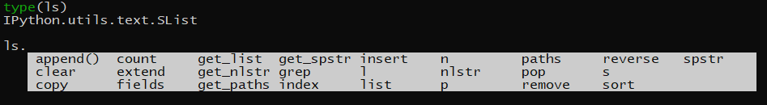

## Course Outline

- Ipython shell commands
- Shell commands with sub process
- Walking the file system
- Command line functions

## IPython shell commands

- Python Interpreter

  - Ipython allows execution of shell commands via `!`
  - In order to use the shell command in python use `subprocess` module
  - Output of the shell command can be stored in a variable with special type called `SList`
  - Python script can be run in two ways
    - Passing in the python script (`.py` file) `python hello.py`
    - Commands can be passed directly  as a string with `-c` flag `print -c "print('Hello')"` → Separate multi line commands with `;`

- Capture Ipython Shell Commands

  - Unix Philosophy → OS should provide easy to use commands which when grouped together can be used for complex tasks

  - Same is used in IPython magic commands, It collects the stdout of the execution and stored  it into variables

    ```python
    %%bash --out output # output is the variable in which the result of the magic 
    #Command will be stored
    ls -l
    
    >>> type(output)
    >>> str
    ```

  - List all the magic commands available `%lsmagic`

  - There are two ways to use shell commands in ipython either through `!` or use `magic commands`

  - Advantage of using `!` is that the output is converted into a `SList` which has many bulit-in functions

    

  - In addition to normal list `SList`  has many additional functionalities

  - magic commands `%%` returns the output of the execution as a `str`

  - To capture stderr in bash magic mode we should add an additional flag `--err`

  - Awk is a tool that is used often on the Unix command line because it understands how to deal with whitespace delimited output from shell commands. The `awk` command works well at grabbing fields from a string.

- Automate with `SList`

  - `fields` -`awk` like commands on the returned list

  ```python
  ls = !ls -l
  #ls is now the SList has access to fields method
  ls.field(4)[1:]
  
  # This returns the value on the 5th element inside the list searching through
  # the list items starting at index 1
  ```

  - `grep` - pattern matching on the list
  - `sort` - sort the list based on particular column either alphabetical or num order
  - normal list operation like `pop` can be performed on the SList
  - Convert this SList into normal `list`, `set`, `dict` by passing the SList to respective command

## Shell Commands with Sub process

- Execute shell command in subprocess

  - Python provides an API for all most anything like executing the unix command or connecting to databases ,cloud providers etc.
  - Module `subprocess` is used to run UNIX like commands
  - `[subprocess.run](http://subprocess.run)` takes in the list of strings which are commands to execute
  - Output of the sub process is not captured (Reference 2 for capturing output)
  - In python 3 the returned result of execution is byte string and care should be taken to convert it to `utf-8`
  - If we assign `subprocess.run()`to a variable it will be an object of type CompletedProcess which will contain returncode of the process and the arguments used to generate the output.
  
```python
  import subprocess
  ls = subprocess.run(["ls","-l"])
  
  >>> print(ls) 
  # CompletedProcess(args=['ls'], returncode=0)
  
  # Subprocess has now attribute to check the completion status
  ls.returncode
  >>> 0 
  ```
  
- STDERR `$?` returns the status code for the execution
    - 0 meaning sucessful
    - any non zero between 1 and 255 means unsucessfull
  - This return code can then be used to analyze the status of run of the subprocess and necessary action can then be taken
  
- Capture Output of Shell Command

  - We use `Popen` to run the commands and `Pipe` to  capture the output of the command

  - Popen connects the standard stream (stdin,stderr,stdout)

    

    DataCamp

  - `stdout` can be captured in two ways

    - `stdout.read()` - Returns the output as a string

    - `stdout.readlines()` - Returns the output as a list

    - `shell = False`

      ```python
      from subprocess import Popen, PIPE
      import json
      import pprint
      
      # Use the with context manager to run subprocess.Popen()
      with Popen(["pip","list","--format=json"], stdout=PIPE) as proc:
        # Pipe the output of subprocess.Popen() to stdout
        result = proc.stdout.read()
        
      # Convert the JSON payload to a Python dictionary
      # JSON is a datastructure similar to a Python dictionary
      converted_result = json.loads(result)
      
      # Display the result in the IPython terminal
      pprint.pprint(converted_result)
      
      ```

  - `subprocess.Popen()` object has a method `communicate()` which can be used to interact with the process

  - It takes in input and timeout

    ```python
    # Start a long running process using subprocess.Popen()
    proc = Popen(["sleep", "6"], stdout=PIPE, stderr=PIPE)
    
    # Use subprocess.communicate() to create a timeout 
    try:
        output, error = proc.communicate(timeout=5)
        
    except TimeoutExpired:
    
    	# Cleanup the process if it takes longer than the timeout
        proc.kill()
        
        # Read standard out and standard error streams and print
        output, error = proc.communicate()
        print(f"Process timed out with output: {output}, error: {error}")
    ```

  - `input` is the arguments that can be passed to the shell command

  - `timeout` sets the limit for the process to finish

  - By default input to the Popen should be bytes and the output returned by the popen will also be bytes

  - `stdout` , `stderr` → Defined inside Popen

- Sending inputs to the shell command

  - In case of multiple commands piping is used in bash
  - In python one subprocess can be passed as a input to the

  ```python
  import subprocess
  
  # runs find command to search for files
  find = subprocess.Popen(
      ["find", ".", "-type", "f", "-print"], stdout=subprocess.PIPE)
  
  # runs wc and counts the number of lines
  word_count = subprocess.Popen(
      ["wc", "-l"], stdin=find.stdout, stdout=subprocess.PIPE)
  
  # print the decoded and formatted output
  output = word_count.stdout.read()
  print(output.decode('utf-8').strip())
  ```

- Passing arguments safely to shell commands

  - `shell = False` is safer option
  - `shell=True` allows user to enter malicious code which is a security threat
  - use `shellx` which can sanitize the strings before passing it into the shell command
  - `rm -rf` will recursively delete all the files inside the folder
  - Assume user inputs will be malacious
  - Always use the principle of least privileges → never give more privilege to a code then it actually needs
  - Reduce complexity
  - `du` - Summarize disk usage of the set of FILEs, recursively for directories.

## Walking File Systems

- Dealing with File Systems

  - `os.walk` recursively walks into the folder free from the given location and returns root,dir and the files
  - root and files returned can be join together with `os.path.join`
  - `pathlib` is object oriented version of `os` module.
  
```python
  # Walk the filesystem starting at the test_dir
  for root, _, files in os.walk('cattle'):
      for name in files:
        	
          # Create the full path to the file by using os.path.join()
          fullpath = os.path.join(root, name)
          print(f"Processing file: {fullpath}")
          
          # Rename file
          if "shorthorn" in name:
              p = pathlib.Path(fullpath)
              shortname = name.split("_")[0][0] # You need to split the name by underscore
              new_name = f"{shortname}_longhorn"
              print(f"Renaming file {name} to {new_name}")
              p.rename(new_name)
  ```
  
```python
  # Walk the filesystem starting at the my path
  for root, _, files in os.walk('my'):
      for name in files:
        	# Create the full path to the file by using os.path.join()
          fullpath = os.path.join(root, name)
          print(f"Processing file: {fullpath}")
          _, ext = os.path.splitext(fullpath)
          # Match the extension pattern .joblib
          if ext == ".joblib":
              clf = joblib.load(fullpath)
              break
  
  # Predict from pickled model
  print(clf.predict(X_digits))
  ```
  
- Finding Files Matching a Pattern

  - `from pathlib import Path`

  - `Path.glob()` can help us

    - Find patterns in directories
    - yield matches
    - can recursively search

    ```python
    import pathlib
    import os
    
    path = pathlib.Path('prod')
    matches = sorted(path.glob("*.jar"))
    for match in matches:
      print(f"Found rogue .jar file in production: {match}")
    ```

  - Generator is returned

  - `os.walk()` can also be used to find the patterns in the files

  - considered low level then `Path.glob()` approach

  - `fnmatch` unix filename pattern matching

  ```python
  import fnmatch
  
  # List of file names to process
  files = ["data1.csv", "script.py", "image.png", "data2.csv", "all.py"]
  
  # Function that returns 
  def csv_matches(list_of_files):
      """Return matches for csv files"""
  
      matches = fnmatch.filter(list_of_files, "*.csv")
      return matches
  
  # Call function to find matches
  matches = csv_matches(files)
  print(f"Found matches: {matches}")
  ```

  - can be converted to regex using `fnmatch.translate()`

- High-level file and directory operations

  - `shutil` high level file operations

    - copy tree
    - delete tree
    - archive tree - converts the folder and files into a `tar.gz` zip file which has very less size then the original

    ```python
    username = "user1"
    root_dir = "/tmp"
    # archive root
    apath = "/tmp/archive"
    # archive base
    final_archive_base = f"{apath}/{username}"
    
    # create tar and gzipped archive
    make_archive(final_archive_base,"gztar", apath)
    
    # create zip archive
    make_archive(final_archive_base, 'zip', apath)
    
    # print out archives
    print(os.listdir(apath))
    ```

  - `tempfile` generates temp files and directories that deletes itself on exit of the context manager

  ```python
  # Create a self-destructing temporary file
  with tempfile.NamedTemporaryFile() as exploding_file:
    	# This file will be deleted automatically after the with statement block
      print(f"Temp file created: {exploding_file.name}")
      exploding_file.write(b"This message will self-destruct in 5....4...\n")
      
      # Get to the top of the file
      exploding_file.seek(0)
  
      #Print the message
      print(exploding_file.read())
  
  # Check to sure file self-destructed
  if not os.path.exists(exploding_file.name): 
      print(f"self-destruction verified: {exploding_file.name}")
  ```

- Using Pathlib

  - Object oriented file system path
  - POSIX stands for Portable Operating System Interface
  - POSIX is an attempt by a consortium of vendors to create a single standard version of UNIX
  - On the path object `resolve` method can be called to convert it into a absolute path

  ```python
  from subprocess import run, PIPE
  
  # Find all the python files you created and print them out
  for i in range(3):
    path = Path(f"/tmp/test/file_{i}.py")
    path.write_text("#!/usr/bin/env python\n")
    path.write_text("import datetime;print(datetime.datetime.now())")
    
  
  # Find all the python files you created and print them out
  for file in Path("/tmp/test/").glob("*.py"):
    # gets the resolved full path
    fullpath = str(file.resolve())
    proc = run(["python3", fullpath], stdout=PIPE)
    print(proc)
  ```

## Command Line Functions

- Using functions for automation

  - Python decorator is a way in which we can easily add a functionality to the existing function.
  - 3 Main concepts to understand decorator
    - Function inside function
    - Return Function
    - Function as an argument

  ```python
  def new_decorator(func):
  
      def wrap():
          print("Adding code before Function")
          func()
          print("Adding code after Function")
      return wrap
  
  # @new_decorator
  def fun_needs_decorator():
      print("Decorate me...")
  
  fun_needs_decorator=new_decorator(fun_needs_decorator)
  fun_needs_decorator()
  ```

  - `@new_decorator` here if this line is commented out `fun_needs_decorator` just prints one line
  - If `@new_decorator` is uncommented It prints 3 lines of code
  - In order to preserve the name of the function and doc string we use `functools.wrap()` function.
  - Name of the function is stored in a special variable called `__name__`

  ```python
  # create decorator
  def debug(f):
  	@wraps(f)
  	def wrap(*args, **kw):
  		result = f(*args, **kw)
  		print(f"function name: {f.__name__}, args: [{args}], kwargs: [{kw}]")
  		return result
  	return wrap
    
  # apply decorator
  @debug
  def mult(x, y=10):
  	return x*y
  print(mult(5, y=5))
  ```

- Understand Script input

  - `sys.argv` → captures input to the script as a list
  - Similar to `$@` or `$*`
  
- Introduction to click

  - Click is a simple Python module inspired by the stdlib optparse to make
    writing command line scripts fun. Unlike other modules, it's based
    around a simple API that does not come with too much magic and is
    composable.
  - Converts a function into a command and helps in creating a `--help` for the command created
  - 3 Main Features
    - arbitrary nesting of commands
    - automatic help page generation
    - lazy loading of sub commands during runtime
  - General template consist of two decorators `@click.command()` and `@click.option()`
  - `click.echo()` prints out the result to `stdout`
  
- Using click to write command line tools

  - `@click.group()` can be used to map a function to a subcommand
  - Makes a logical grouping of the sub commands
  - click utilities can
    - generate a colored output to show error and warnings
    - generate paginated output
    - clear the screen
    - wait for key press
    - launch editors
    - write files
  - click can be used to return both unicode and binary data
  - Coloured text and background
  - Blinking text etc
  - click commands can be checked internally using `click.testing.CliRunner()`

## References

[tempfile - Generate temporary files and directories - Python 3.8.3rc1 documentation](https://docs.python.org/3/library/tempfile.html)

## Ipython , Shell and Subprocess

[Built-in magic commands - IPython 7.14.0 documentation](https://ipython.readthedocs.io/en/stable/interactive/magics.html)

[shlex - Simple lexical analysis - Python 3.8.3rc1 documentation](https://docs.python.org/3/library/shlex.html)

[fnmatch - Unix filename pattern matching - Python 3.8.3rc1 documentation](https://docs.python.org/3.8/library/fnmatch.html#module-fnmatch)

[Running shell command and capturing the output](https://stackoverflow.com/a/4760517/11899980)

[subprocess - Subprocess management - Python 3.8.3rc1 documentation](https://docs.python.org/3/library/subprocess.html#using-the-subprocess-module)

## OS , Pathlib and Shutil

[Python os.stat() Method](https://www.tutorialspoint.com/python/os_stat.htm)

[Pathlib Is Wonderful!](https://jefftriplett.com/2017/pathlib-is-wonderful/)

[Why you should be using pathlib](https://treyhunner.com/2018/12/why-you-should-be-using-pathlib/)

[No really, pathlib is great](https://treyhunner.com/2019/01/no-really-pathlib-is-great/)

[Python 3's pathlib Module: Taming the File System - Real Python](https://realpython.com/python-pathlib/)

[Introduction to the Python Pathlib Module](https://stackabuse.com/introduction-to-the-python-pathlib-module/)

[Python shutil module - JournalDev](https://www.journaldev.com/20536/python-shutil-module)

## Decorators,Click

[Python Decorators: A Step-By-Step Introduction - dbader.org](https://dbader.org/blog/python-decorators)

[Welcome to Click - Click Documentation (7.x)](https://click.palletsprojects.com/en/7.x/)

[Writing Python Command-Line Tools With Click - dbader.org](https://dbader.org/blog/python-commandline-tools-with-click)

[Mastering Click: Writing Advanced Python Command-Line Apps - dbader.org](