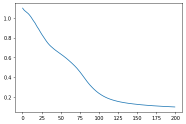

```python
import torch
import torch.nn as nn
import torch.nn.functional as F
import matplotlib.pyplot as plt
import numpy as np
import pandas as pd
```


```python
df = pd.read_csv("data/iris.csv")
```


```python
df.head()
```


<div>
<style scoped>
    .dataframe tbody tr th:only-of-type {
        vertical-align: middle;
    }

    .dataframe tbody tr th {
        vertical-align: top;
    }
    
    .dataframe thead th {
        text-align: right;
    }
</style>
<table border="1" class="dataframe">
  <thead>
    <tr style="text-align: right;">
      <th></th>
      <th>sepal length (cm)</th>
      <th>sepal width (cm)</th>
      <th>petal length (cm)</th>
      <th>petal width (cm)</th>
      <th>target</th>
    </tr>
  </thead>
  <tbody>
    <tr>
      <th>0</th>
      <td>5.1</td>
      <td>3.5</td>
      <td>1.4</td>
      <td>0.2</td>
      <td>0.0</td>
    </tr>
    <tr>
      <th>1</th>
      <td>4.9</td>
      <td>3.0</td>
      <td>1.4</td>
      <td>0.2</td>
      <td>0.0</td>
    </tr>
    <tr>
      <th>2</th>
      <td>4.7</td>
      <td>3.2</td>
      <td>1.3</td>
      <td>0.2</td>
      <td>0.0</td>
    </tr>
    <tr>
      <th>3</th>
      <td>4.6</td>
      <td>3.1</td>
      <td>1.5</td>
      <td>0.2</td>
      <td>0.0</td>
    </tr>
    <tr>
      <th>4</th>
      <td>5.0</td>
      <td>3.6</td>
      <td>1.4</td>
      <td>0.2</td>
      <td>0.0</td>
    </tr>
  </tbody>
</table>
</div>


```python
X = df.drop('target',axis =1).values
y = df.target.values
```


```python
X[:5]
```


    array([[5.1, 3.5, 1.4, 0.2],
           [4.9, 3. , 1.4, 0.2],
           [4.7, 3.2, 1.3, 0.2],
           [4.6, 3.1, 1.5, 0.2],
           [5. , 3.6, 1.4, 0.2]])


```python
y[:5]
```


    array([0., 0., 0., 0., 0.])


## Using Sklearn Train Test Split for Tabular Data


```python
from sklearn.model_selection import train_test_split
```


```python
X_train,X_test,y_train,y_test=train_test_split(X,y,test_size=0.2,random_state=1)
```


```python
X_train[:5]
```


    array([[6.1, 3. , 4.6, 1.4],
           [7.7, 3. , 6.1, 2.3],
           [5.6, 2.5, 3.9, 1.1],
           [6.4, 2.8, 5.6, 2.1],
           [5.8, 2.8, 5.1, 2.4]])


```python
y_train[:5].reshape(-1,1)
```


    array([[1.],
           [2.],
           [1.],
           [2.],
           [2.]])


Here the data is small and we where able to load all them at once. what if the data is large and we want to load it in batches. For this a simpler method is to use DataLoader.

### Using Pytorch inbuild data loading functions


```python
from torch.utils.data import TensorDataset, DataLoader
```


```python
print(help(DataLoader))
```

    Help on class DataLoader in module torch.utils.data.dataloader:
    
    class DataLoader(builtins.object)
     |  DataLoader(dataset, batch_size=1, shuffle=False, sampler=None, batch_sampler=None, num_workers=0, collate_fn=None, pin_memory=False, drop_last=False, timeout=0, worker_init_fn=None, multiprocessing_context=None)
     |  
     |  Data loader. Combines a dataset and a sampler, and provides an iterable over
     |  the given dataset.
     |  
     |  The :class:`~torch.utils.data.DataLoader` supports both map-style and
     |  iterable-style datasets with single- or multi-process loading, customizing
     |  loading order and optional automatic batching (collation) and memory pinning.
     |  
     |  See :py:mod:`torch.utils.data` documentation page for more details.
     |  
     |  Arguments:
     |      dataset (Dataset): dataset from which to load the data.
     |      batch_size (int, optional): how many samples per batch to load
     |          (default: ``1``).
     |      shuffle (bool, optional): set to ``True`` to have the data reshuffled
     |          at every epoch (default: ``False``).
     |      sampler (Sampler, optional): defines the strategy to draw samples from
     |          the dataset. If specified, :attr:`shuffle` must be ``False``.
     |      batch_sampler (Sampler, optional): like :attr:`sampler`, but returns a batch of
     |          indices at a time. Mutually exclusive with :attr:`batch_size`,
     |          :attr:`shuffle`, :attr:`sampler`, and :attr:`drop_last`.
     |      num_workers (int, optional): how many subprocesses to use for data
     |          loading. ``0`` means that the data will be loaded in the main process.
     |          (default: ``0``)
     |      collate_fn (callable, optional): merges a list of samples to form a
     |          mini-batch of Tensor(s).  Used when using batched loading from a
     |          map-style dataset.
     |      pin_memory (bool, optional): If ``True``, the data loader will copy Tensors
     |          into CUDA pinned memory before returning them.  If your data elements
     |          are a custom type, or your :attr:`collate_fn` returns a batch that is a custom type,
     |          see the example below.
     |      drop_last (bool, optional): set to ``True`` to drop the last incomplete batch,
     |          if the dataset size is not divisible by the batch size. If ``False`` and
     |          the size of dataset is not divisible by the batch size, then the last batch
     |          will be smaller. (default: ``False``)
     |      timeout (numeric, optional): if positive, the timeout value for collecting a batch
     |          from workers. Should always be non-negative. (default: ``0``)
     |      worker_init_fn (callable, optional): If not ``None``, this will be called on each
     |          worker subprocess with the worker id (an int in ``[0, num_workers - 1]``) as
     |          input, after seeding and before data loading. (default: ``None``)
     |  
     |  
     |  .. warning:: If the ``spawn`` start method is used, :attr:`worker_init_fn`
     |               cannot be an unpicklable object, e.g., a lambda function. See
     |               :ref:`multiprocessing-best-practices` on more details related
     |               to multiprocessing in PyTorch.
     |  
     |  .. note:: ``len(dataloader)`` heuristic is based on the length of the sampler used.
     |            When :attr:`dataset` is an :class:`~torch.utils.data.IterableDataset`,
     |            ``len(dataset)`` (if implemented) is returned instead, regardless
     |            of multi-process loading configurations, because PyTorch trust
     |            user :attr:`dataset` code in correctly handling multi-process
     |            loading to avoid duplicate data. See `Dataset Types`_ for more
     |            details on these two types of datasets and how
     |            :class:`~torch.utils.data.IterableDataset` interacts with `Multi-process data loading`_.
     |  
     |  Methods defined here:
     |  
     |  __init__(self, dataset, batch_size=1, shuffle=False, sampler=None, batch_sampler=None, num_workers=0, collate_fn=None, pin_memory=False, drop_last=False, timeout=0, worker_init_fn=None, multiprocessing_context=None)
     |      Initialize self.  See help(type(self)) for accurate signature.
     |  
     |  __iter__(self)
     |  
     |  __len__(self)
     |  
     |  __setattr__(self, attr, val)
     |      Implement setattr(self, name, value).
     |  
     |  ----------------------------------------------------------------------
     |  Data descriptors defined here:
     |  
     |  __dict__
     |      dictionary for instance variables (if defined)
     |  
     |  __weakref__
     |      list of weak references to the object (if defined)
     |  
     |  multiprocessing_context
    
    None


We can specify the number of batches in which data needs to be split and we can shuffle the data before inputting it into our model


```python
features = df.drop('target',axis=1).values
target = df.target.values
```


```python
iris= TensorDataset(torch.FloatTensor(features),torch.LongTensor(target))
```


```python
iris_loader = DataLoader(iris,batch_size=50,shuffle = True)
```


```python
for i,batch in enumerate(iris_loader):
    print(i,batch)
```

    0 [tensor([[6.7000, 3.1000, 5.6000, 2.4000],
            [5.0000, 3.3000, 1.4000, 0.2000],
            [7.1000, 3.0000, 5.9000, 2.1000],
            [6.2000, 3.4000, 5.4000, 2.3000],
            [5.7000, 3.8000, 1.7000, 0.3000],
            [4.3000, 3.0000, 1.1000, 0.1000],
            [5.1000, 3.3000, 1.7000, 0.5000],
            [4.9000, 3.1000, 1.5000, 0.1000],
            [7.2000, 3.2000, 6.0000, 1.8000],
            [4.9000, 3.1000, 1.5000, 0.1000],
            [7.7000, 2.8000, 6.7000, 2.0000],
            [5.2000, 3.5000, 1.5000, 0.2000],
            [4.8000, 3.4000, 1.9000, 0.2000],
            [4.9000, 2.5000, 4.5000, 1.7000],
            [6.0000, 2.2000, 4.0000, 1.0000],
            [7.7000, 2.6000, 6.9000, 2.3000],
            [5.1000, 3.8000, 1.6000, 0.2000],
            [5.1000, 2.5000, 3.0000, 1.1000],
            [7.6000, 3.0000, 6.6000, 2.1000],
            [5.2000, 4.1000, 1.5000, 0.1000],
            [6.1000, 3.0000, 4.9000, 1.8000],
            [6.3000, 2.3000, 4.4000, 1.3000],
            [4.6000, 3.2000, 1.4000, 0.2000],
            [6.5000, 3.0000, 5.2000, 2.0000],
            [6.6000, 3.0000, 4.4000, 1.4000],
            [5.2000, 2.7000, 3.9000, 1.4000],
            [6.8000, 3.0000, 5.5000, 2.1000],
            [5.7000, 2.8000, 4.5000, 1.3000],
            [7.2000, 3.6000, 6.1000, 2.5000],
            [6.3000, 2.8000, 5.1000, 1.5000],
            [6.5000, 3.0000, 5.8000, 2.2000],
            [6.3000, 2.7000, 4.9000, 1.8000],
            [5.4000, 3.9000, 1.3000, 0.4000],
            [5.9000, 3.0000, 5.1000, 1.8000],
            [7.9000, 3.8000, 6.4000, 2.0000],
            [6.3000, 3.3000, 4.7000, 1.6000],
            [5.0000, 3.2000, 1.2000, 0.2000],
            [5.0000, 3.5000, 1.3000, 0.3000],
            [5.5000, 2.3000, 4.0000, 1.3000],
            [6.4000, 3.2000, 4.5000, 1.5000],
            [6.4000, 2.8000, 5.6000, 2.1000],
            [5.6000, 3.0000, 4.5000, 1.5000],
            [7.0000, 3.2000, 4.7000, 1.4000],
            [4.8000, 3.0000, 1.4000, 0.1000],
            [4.8000, 3.1000, 1.6000, 0.2000],
            [5.4000, 3.4000, 1.7000, 0.2000],
            [7.3000, 2.9000, 6.3000, 1.8000],
            [5.4000, 3.9000, 1.7000, 0.4000],
            [6.3000, 3.3000, 6.0000, 2.5000],
            [6.7000, 3.1000, 4.7000, 1.5000]]), tensor([2, 0, 2, 2, 0, 0, 0, 0, 2, 0, 2, 0, 0, 2, 1, 2, 0, 1, 2, 0, 2, 1, 0, 2,
            1, 1, 2, 1, 2, 2, 2, 2, 0, 2, 2, 1, 0, 0, 1, 1, 2, 1, 1, 0, 0, 0, 2, 0,
            2, 1])]
    1 [tensor([[5.9000, 3.0000, 4.2000, 1.5000],
            [7.7000, 3.0000, 6.1000, 2.3000],
            [5.4000, 3.0000, 4.5000, 1.5000],
            [6.3000, 2.9000, 5.6000, 1.8000],
            [4.9000, 2.4000, 3.3000, 1.0000],
            [4.6000, 3.1000, 1.5000, 0.2000],
            [5.5000, 2.4000, 3.8000, 1.1000],
            [6.7000, 2.5000, 5.8000, 1.8000],
            [5.6000, 2.5000, 3.9000, 1.1000],
            [6.4000, 3.1000, 5.5000, 1.8000],
            [6.0000, 2.9000, 4.5000, 1.5000],
            [7.7000, 3.8000, 6.7000, 2.2000],
            [6.4000, 2.8000, 5.6000, 2.2000],
            [4.4000, 3.0000, 1.3000, 0.2000],
            [4.5000, 2.3000, 1.3000, 0.3000],
            [5.7000, 2.5000, 5.0000, 2.0000],
            [6.7000, 3.0000, 5.0000, 1.7000],
            [4.4000, 3.2000, 1.3000, 0.2000],
            [5.8000, 2.7000, 3.9000, 1.2000],
            [6.0000, 3.0000, 4.8000, 1.8000],
            [5.0000, 3.0000, 1.6000, 0.2000],
            [5.0000, 3.4000, 1.6000, 0.4000],
            [5.6000, 2.8000, 4.9000, 2.0000],
            [6.4000, 2.9000, 4.3000, 1.3000],
            [5.4000, 3.7000, 1.5000, 0.2000],
            [6.3000, 2.5000, 4.9000, 1.5000],
            [5.5000, 2.5000, 4.0000, 1.3000],
            [5.5000, 2.6000, 4.4000, 1.2000],
            [6.8000, 3.2000, 5.9000, 2.3000],
            [5.7000, 2.9000, 4.2000, 1.3000],
            [6.1000, 2.6000, 5.6000, 1.4000],
            [5.0000, 3.5000, 1.6000, 0.6000],
            [5.4000, 3.4000, 1.5000, 0.4000],
            [6.1000, 2.8000, 4.0000, 1.3000],
            [6.7000, 3.0000, 5.2000, 2.3000],
            [5.1000, 3.4000, 1.5000, 0.2000],
            [6.7000, 3.1000, 4.4000, 1.4000],
            [6.9000, 3.2000, 5.7000, 2.3000],
            [6.8000, 2.8000, 4.8000, 1.4000],
            [6.2000, 2.9000, 4.3000, 1.3000],
            [5.0000, 3.6000, 1.4000, 0.2000],
            [6.5000, 2.8000, 4.6000, 1.5000],
            [6.0000, 2.2000, 5.0000, 1.5000],
            [5.2000, 3.4000, 1.4000, 0.2000],
            [5.8000, 4.0000, 1.2000, 0.2000],
            [4.8000, 3.0000, 1.4000, 0.3000],
            [6.9000, 3.1000, 5.4000, 2.1000],
            [5.7000, 3.0000, 4.2000, 1.2000],
            [4.6000, 3.4000, 1.4000, 0.3000],
            [6.3000, 2.5000, 5.0000, 1.9000]]), tensor([1, 2, 1, 2, 1, 0, 1, 2, 1, 2, 1, 2, 2, 0, 0, 2, 1, 0, 1, 2, 0, 0, 2, 1,
            0, 1, 1, 1, 2, 1, 2, 0, 0, 1, 2, 0, 1, 2, 1, 1, 0, 1, 2, 0, 0, 0, 2, 1,
            0, 2])]
    2 [tensor([[5.8000, 2.7000, 5.1000, 1.9000],
            [7.2000, 3.0000, 5.8000, 1.6000],
            [6.9000, 3.1000, 5.1000, 2.3000],
            [6.1000, 3.0000, 4.6000, 1.4000],
            [5.8000, 2.7000, 4.1000, 1.0000],
            [5.5000, 2.4000, 3.7000, 1.0000],
            [5.1000, 3.5000, 1.4000, 0.3000],
            [6.9000, 3.1000, 4.9000, 1.5000],
            [4.9000, 3.0000, 1.4000, 0.2000],
            [5.9000, 3.2000, 4.8000, 1.8000],
            [4.8000, 3.4000, 1.6000, 0.2000],
            [6.4000, 2.7000, 5.3000, 1.9000],
            [4.9000, 3.1000, 1.5000, 0.1000],
            [6.5000, 3.2000, 5.1000, 2.0000],
            [5.0000, 2.3000, 3.3000, 1.0000],
            [6.6000, 2.9000, 4.6000, 1.3000],
            [5.6000, 3.0000, 4.1000, 1.3000],
            [5.1000, 3.8000, 1.9000, 0.4000],
            [4.7000, 3.2000, 1.3000, 0.2000],
            [6.1000, 2.9000, 4.7000, 1.4000],
            [5.1000, 3.5000, 1.4000, 0.2000],
            [5.8000, 2.8000, 5.1000, 2.4000],
            [6.3000, 3.4000, 5.6000, 2.4000],
            [4.6000, 3.6000, 1.0000, 0.2000],
            [5.1000, 3.7000, 1.5000, 0.4000],
            [6.5000, 3.0000, 5.5000, 1.8000],
            [5.6000, 2.9000, 3.6000, 1.3000],
            [5.6000, 2.7000, 4.2000, 1.3000],
            [5.0000, 2.0000, 3.5000, 1.0000],
            [7.4000, 2.8000, 6.1000, 1.9000],
            [5.7000, 4.4000, 1.5000, 0.4000],
            [6.2000, 2.8000, 4.8000, 1.8000],
            [5.8000, 2.6000, 4.0000, 1.2000],
            [5.8000, 2.7000, 5.1000, 1.9000],
            [5.3000, 3.7000, 1.5000, 0.2000],
            [6.0000, 3.4000, 4.5000, 1.6000],
            [4.7000, 3.2000, 1.6000, 0.2000],
            [6.0000, 2.7000, 5.1000, 1.6000],
            [6.1000, 2.8000, 4.7000, 1.2000],
            [6.7000, 3.3000, 5.7000, 2.5000],
            [6.2000, 2.2000, 4.5000, 1.5000],
            [5.5000, 4.2000, 1.4000, 0.2000],
            [5.5000, 3.5000, 1.3000, 0.2000],
            [6.4000, 3.2000, 5.3000, 2.3000],
            [5.7000, 2.6000, 3.5000, 1.0000],
            [6.7000, 3.3000, 5.7000, 2.1000],
            [5.7000, 2.8000, 4.1000, 1.3000],
            [5.1000, 3.8000, 1.5000, 0.3000],
            [4.4000, 2.9000, 1.4000, 0.2000],
            [5.0000, 3.4000, 1.5000, 0.2000]]), tensor([2, 2, 2, 1, 1, 1, 0, 1, 0, 1, 0, 2, 0, 2, 1, 1, 1, 0, 0, 1, 0, 2, 2, 0,
            0, 2, 1, 1, 1, 2, 0, 2, 1, 2, 0, 1, 0, 1, 1, 2, 1, 0, 0, 2, 1, 2, 1, 0,
            0, 0])]


Divides the dataset with 150 entries into 3 batches (Specified Batch size =50) and shuffled the data and created test train split more effectively than the above method.

This data can be send to our model 50 examples at a time.

## ANN


```python
class Model(nn.Module):
    
    def __init__(self,in_features=4,h1=6,h2=3,out_features=3):
        super().__init__()
        self.fc1 = nn.Linear(in_features,h1)
        self.fc2 = nn.Linear(h1,h2)
        self.out = nn.Linear(h2,out_features)
    
    def forward(self,x):
        x = F.relu(self.fc1(x))
        x = F.relu(self.fc2(x))
        x = self.out(x)
        return x
```


```python
model = Model()
```


```python
model
```


    Model(
      (fc1): Linear(in_features=4, out_features=6, bias=True)
      (fc2): Linear(in_features=6, out_features=3, bias=True)
      (out): Linear(in_features=3, out_features=3, bias=True)
    )


```python
model.fc1.weight
```


    Parameter containing:
    tensor([[ 0.2376, -0.0879, -0.0915,  0.3626],
            [ 0.2472, -0.2576,  0.2385, -0.1738],
            [-0.4534, -0.3402,  0.1171,  0.0327],
            [-0.4450, -0.4571, -0.4225, -0.2827],
            [-0.0142,  0.0934,  0.0549, -0.2397],
            [ 0.4406, -0.2365,  0.1471, -0.3460]], requires_grad=True)


```python
model.fc1.bias
```


    Parameter containing:
    tensor([ 0.0931,  0.2283, -0.2173,  0.1714,  0.1598, -0.0328],
           requires_grad=True)


- Shape of the weight tensor between input(4,1) and h1 (6,1) is (4,6)
- Shape of the bias tensor between input(4,1) and h1(6,1) is depended on h1. It has 6 values corresponding to each neuron in h1.


```python
features = torch.FloatTensor(features)
target = torch.LongTensor(target)
```


```python
X_train, X_test, y_train, y_test=train_test_split(features,target,random_state=59,test_size=0.2)
```


```python
# Classification problem => Evaluated based on Cross Entropy Loss
criterion = nn.CrossEntropyLoss()

#Optimizer
optimizer = torch.optim.Adam(model.parameters(),lr=0.01)

#Epochs
epochs = 200
losses = []

for i in range(epochs):
    
    ypred = model.forward(X_train)
    
    loss = criterion(ypred,y_train)
    #Keeping track of loss
    losses.append(loss.item())
    

    if i%10==0:
        print(f'Epoch:{i},loss:{loss:.2f}')
        
    #Backpropagation
    optimizer.zero_grad()
    loss.backward()
    optimizer.step()
```

    Epoch:0,loss:1.10
    Epoch:10,loss:1.02
    Epoch:20,loss:0.90
    Epoch:30,loss:0.78
    Epoch:40,loss:0.69
    Epoch:50,loss:0.63
    Epoch:60,loss:0.57
    Epoch:70,loss:0.50
    Epoch:80,loss:0.40
    Epoch:90,loss:0.30
    Epoch:100,loss:0.23
    Epoch:110,loss:0.19
    Epoch:120,loss:0.16
    Epoch:130,loss:0.14
    Epoch:140,loss:0.13
    Epoch:150,loss:0.12
    Epoch:160,loss:0.12
    Epoch:170,loss:0.11
    Epoch:180,loss:0.10
    Epoch:190,loss:0.10


```python
plt.plot(range(epochs),losses)
plt.show()
```





## Predicting performance on unseen data


```python
with torch.no_grad():
    yval = model.forward(X_test)
    loss=criterion(yval,y_test)
```


```python
loss
```


    tensor(0.0518)


```python
correct =0
for i,data in enumerate(X_test):
    yval = model.forward(data)
    
    print(f"Predicted:{yval.argmax()} Actual:{y_test[i]}")
    if yval.argmax().item()== y_test[i]:
        correct+=1
    
print(f"We got {correct} Correct! out of {len(X_test)}")
    
```

    Predicted:1 Actual:1
    Predicted:0 Actual:0
    Predicted:2 Actual:2
    Predicted:2 Actual:2
    Predicted:2 Actual:2
    Predicted:2 Actual:2
    Predicted:1 Actual:1
    Predicted:0 Actual:0
    Predicted:2 Actual:2
    Predicted:2 Actual:2
    Predicted:2 Actual:2
    Predicted:1 Actual:1
    Predicted:1 Actual:1
    Predicted:0 Actual:0
    Predicted:0 Actual:0
    Predicted:0 Actual:0
    Predicted:2 Actual:2
    Predicted:1 Actual:1
    Predicted:0 Actual:0
    Predicted:2 Actual:2
    Predicted:1 Actual:1
    Predicted:2 Actual:2
    Predicted:2 Actual:2
    Predicted:2 Actual:2
    Predicted:1 Actual:1
    Predicted:2 Actual:2
    Predicted:1 Actual:1
    Predicted:0 Actual:0
    Predicted:0 Actual:0
    Predicted:0 Actual:0
    We got 30 Correct! out of 30


