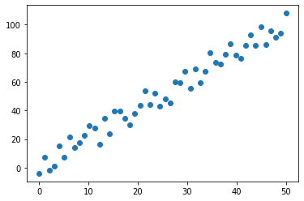

## Importing Necessary Modules


```python
import torch
import torch.nn as nn
import matplotlib.pyplot as plt
import numpy as np
import pandas as pd
```


```python
torch.__version__
```


    '1.4.0'

## Creating Dummy Data


```python
x = torch.linspace(0.,50.,50).reshape(-1,1)
```


```python
e = torch.randint(-10,+11,(50,1),dtype=torch.float)
```


```python
y  = 2*x+1 + e
```

Actual weights and bias based on the equation.

- weight = 2
- bias = 1


```python
plt.scatter(x,y)
plt.show()
```





## Defining the module


```python
class Model(nn.Module):
    
    # Initializing the class
    def __init__(self,in_features,out_features):
        
        #Initializing the base class
        super().__init__()
        #
        self.linear = nn.Linear(in_features,out_features)
    
    def forward(self,x):
        ypred = self.linear(x)
        return ypred
```


```python
#Creating an instance of the class
model = Model(1,1)

ypred=model.forward(x)
```

Now from the above we have just did a forward pass where nn.Linear will assign a random weight and bias. So we will expect our model to perform really badly


```python
model.linear.weight.item(),model.linear.bias.item()
```


    (0.6533929109573364, -0.5177580118179321)


```python
print(f'As we guessed the value of weight {model.linear.weight.item():.2f} and bias {model.linear.bias.item():.2f} Is far from the original values')
```

    As we guessed the value of weight 0.65 and bias -0.52 Is far from the original values

```python
x.size()
```


    torch.Size([50, 1])


```python
ypred.size()
```


    torch.Size([50, 1])


```python
plt.scatter(x,y)
plt.plot(x.numpy().flatten() , ypred.detach().numpy().flatten(),c="red")
plt.show()
```


## Lets train the model

- We have to mention the criterion on which we train our model
- The optimizer which we are going to use
- Number of epochs for which we are going to run the model for


```python
criterion = nn.MSELoss()
optimizer = torch.optim.SGD(model.parameters(),lr=0.001)

epochs = 50
losses = [] # To keep track of the loss generated so we can visualize

for i in range(epochs):
    i +=1
    
    
    ypred = model.forward(x)
    
    loss= criterion(ypred,y)
    
    losses.append(loss.item())
    
    optimizer.zero_grad()
    
    loss.backward()
    
    optimizer.step()
    print(f'epoch:{i}, loss:{loss.item():.2f},weight:{model.linear.weight.item():.2f},bias:{model.linear.bias.item():.2f}')
```

    epoch:1, loss:1684.86,weight:3.01,bias:-0.45
    epoch:2, loss:808.46,weight:1.40,bias:-0.49
    epoch:3, loss:397.03,weight:2.50,bias:-0.46
    epoch:4, loss:203.90,weight:1.74,bias:-0.48
    epoch:5, loss:113.23,weight:2.26,bias:-0.47
    epoch:6, loss:70.66,weight:1.91,bias:-0.48
    epoch:7, loss:50.68,weight:2.15,bias:-0.47
    epoch:8, loss:41.30,weight:1.98,bias:-0.47
    epoch:9, loss:36.90,weight:2.10,bias:-0.47
    epoch:10, loss:34.83,weight:2.02,bias:-0.47
    epoch:11, loss:33.86,weight:2.07,bias:-0.47
    epoch:12, loss:33.40,weight:2.04,bias:-0.47
    epoch:13, loss:33.19,weight:2.06,bias:-0.46
    epoch:14, loss:33.08,weight:2.05,bias:-0.46
    epoch:15, loss:33.04,weight:2.06,bias:-0.46
    epoch:16, loss:33.01,weight:2.05,bias:-0.46
    epoch:17, loss:33.00,weight:2.05,bias:-0.46
    epoch:18, loss:33.00,weight:2.05,bias:-0.46
    epoch:19, loss:32.99,weight:2.05,bias:-0.46
    epoch:20, loss:32.99,weight:2.05,bias:-0.46
    epoch:21, loss:32.99,weight:2.05,bias:-0.46
    epoch:22, loss:32.99,weight:2.05,bias:-0.46
    epoch:23, loss:32.99,weight:2.05,bias:-0.46
    epoch:24, loss:32.99,weight:2.05,bias:-0.45
    epoch:25, loss:32.99,weight:2.05,bias:-0.45
    epoch:26, loss:32.99,weight:2.05,bias:-0.45
    epoch:27, loss:32.99,weight:2.05,bias:-0.45
    epoch:28, loss:32.98,weight:2.05,bias:-0.45
    epoch:29, loss:32.98,weight:2.05,bias:-0.45
    epoch:30, loss:32.98,weight:2.05,bias:-0.45
    epoch:31, loss:32.98,weight:2.05,bias:-0.45
    epoch:32, loss:32.98,weight:2.05,bias:-0.45
    epoch:33, loss:32.98,weight:2.05,bias:-0.45
    epoch:34, loss:32.98,weight:2.05,bias:-0.45
    epoch:35, loss:32.98,weight:2.05,bias:-0.44
    epoch:36, loss:32.98,weight:2.05,bias:-0.44
    epoch:37, loss:32.98,weight:2.05,bias:-0.44
    epoch:38, loss:32.98,weight:2.05,bias:-0.44
    epoch:39, loss:32.98,weight:2.05,bias:-0.44
    epoch:40, loss:32.98,weight:2.05,bias:-0.44
    epoch:41, loss:32.97,weight:2.05,bias:-0.44
    epoch:42, loss:32.97,weight:2.05,bias:-0.44
    epoch:43, loss:32.97,weight:2.05,bias:-0.44
    epoch:44, loss:32.97,weight:2.05,bias:-0.44
    epoch:45, loss:32.97,weight:2.05,bias:-0.44
    epoch:46, loss:32.97,weight:2.05,bias:-0.44
    epoch:47, loss:32.97,weight:2.05,bias:-0.43
    epoch:48, loss:32.97,weight:2.05,bias:-0.43
    epoch:49, loss:32.97,weight:2.05,bias:-0.43
    epoch:50, loss:32.97,weight:2.05,bias:-0.43

```python
plt.scatter(x,y)
plt.plot(x.numpy().flatten() , ypred.detach().numpy().flatten(),c="red")
plt.show()
```


```python
plt.plot(range(epochs),losses)
plt.show()
```


