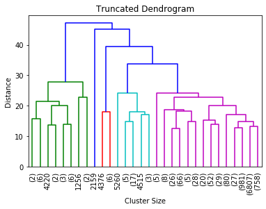

<h2 align='center'> CLUSTER ANALYSIS


<h4 align='right'> - Kunal Bharadwaj (D19016) & Veera Vignesh (D19036)</h4>
Cluster analysis is form of **unsupervised learning** learning technique which is used when we are unclear or have no idea how to the result should look like.

### Problem Statement
**In this Project we are trying to group the Credit Card Holders of our bank into particular segments so we can serve the customers better (Market Segmentation)**

### Objective
- To segment/group the customer of the bank with credit card active during the last 6 months.
- Make inference about each cluster
- Suggest Marketing strategy for each of the cluster

### Data Dictionary
- Our data consist of 8950 rows and 17 Columns

- Each row represents the individual customer behaviour based on different parameters

  CUST_ID --> Unique ID of the customer 

  BALANCE	--> Balance amount left in their account to make purchases 

  BALANCE_FREQUENCY --> How frequently the Balance is updated, score between 0 and 1 

  PURCHASES --> Amount of purchases made from account 

  ONEOFF_PURCHASES --> Maximum purchase amount done in one-go 

  INSTALLMENTS_PURCHASES --> Amount of purchase done in installment

  CASH_ADVANCE --> Cash withdrawn by the user 

  PURCHASES_FREQUENCY --> How frequently the Purchases are being made, score between 0 and 1 

  ONEOFF_PURCHASES_FREQUENCY --> How frequently Purchases are happening in one-go 

  PURCHASES_INSTALLMENTS_FREQUENCY --> How frequently purchases in installments are being done 

  CASH_ADVANCE_FREQUENCY --> How frequently the cash in advance being paid

  CASH_ADVANCE_TRX --> Number of Transactions made with "Cash in Advanced" 

  PURCHASES_TRX --> Number of purchase transactions made 

  CREDIT_LIMIT --> Limit of Credit Card for user 

  PAYMENTS --> Amount of Payment done by user 

  MINIMUM_PAYMENTS --> Minimum amount of payments made by user 

  PRC_FULL_PAYMENT --> Percent of full payment paid by user 

  TENURE --> Tenure of credit card service for user 


```python
#Import Necessary Modules
import os
import pandas as pd
import numpy as np
import matplotlib.pyplot as plt
import scipy
from scipy.cluster.hierarchy import dendrogram, linkage
import sklearn
from sklearn.cluster import AgglomerativeClustering
```


```python
# Loading Dataset
df = pd.read_csv('CC GENERAL.csv')
```


```python
df.head()
```


<div>
<style scoped>
    .dataframe tbody tr th:only-of-type {
        vertical-align: middle;
    }

    .dataframe tbody tr th {
        vertical-align: top;
    }
    
    .dataframe thead th {
        text-align: right;
    }
</style>
<table border="1" class="dataframe">
  <thead>
    <tr style="text-align: right;">
      <th></th>
      <th>CUST_ID</th>
      <th>BALANCE</th>
      <th>BALANCE_FREQUENCY</th>
      <th>PURCHASES</th>
      <th>ONEOFF_PURCHASES</th>
      <th>INSTALLMENTS_PURCHASES</th>
      <th>CASH_ADVANCE</th>
      <th>PURCHASES_FREQUENCY</th>
      <th>ONEOFF_PURCHASES_FREQUENCY</th>
      <th>PURCHASES_INSTALLMENTS_FREQUENCY</th>
      <th>CASH_ADVANCE_FREQUENCY</th>
      <th>CASH_ADVANCE_TRX</th>
      <th>PURCHASES_TRX</th>
      <th>CREDIT_LIMIT</th>
      <th>PAYMENTS</th>
      <th>MINIMUM_PAYMENTS</th>
      <th>PRC_FULL_PAYMENT</th>
      <th>TENURE</th>
    </tr>
  </thead>
  <tbody>
    <tr>
      <td>0</td>
      <td>C10001</td>
      <td>40.900749</td>
      <td>0.818182</td>
      <td>95.40</td>
      <td>0.00</td>
      <td>95.4</td>
      <td>0.000000</td>
      <td>0.166667</td>
      <td>0.000000</td>
      <td>0.083333</td>
      <td>0.000000</td>
      <td>0</td>
      <td>2</td>
      <td>1000.0</td>
      <td>201.802084</td>
      <td>139.509787</td>
      <td>0.000000</td>
      <td>12</td>
    </tr>
    <tr>
      <td>1</td>
      <td>C10002</td>
      <td>3202.467416</td>
      <td>0.909091</td>
      <td>0.00</td>
      <td>0.00</td>
      <td>0.0</td>
      <td>6442.945483</td>
      <td>0.000000</td>
      <td>0.000000</td>
      <td>0.000000</td>
      <td>0.250000</td>
      <td>4</td>
      <td>0</td>
      <td>7000.0</td>
      <td>4103.032597</td>
      <td>1072.340217</td>
      <td>0.222222</td>
      <td>12</td>
    </tr>
    <tr>
      <td>2</td>
      <td>C10003</td>
      <td>2495.148862</td>
      <td>1.000000</td>
      <td>773.17</td>
      <td>773.17</td>
      <td>0.0</td>
      <td>0.000000</td>
      <td>1.000000</td>
      <td>1.000000</td>
      <td>0.000000</td>
      <td>0.000000</td>
      <td>0</td>
      <td>12</td>
      <td>7500.0</td>
      <td>622.066742</td>
      <td>627.284787</td>
      <td>0.000000</td>
      <td>12</td>
    </tr>
    <tr>
      <td>3</td>
      <td>C10004</td>
      <td>1666.670542</td>
      <td>0.636364</td>
      <td>1499.00</td>
      <td>1499.00</td>
      <td>0.0</td>
      <td>205.788017</td>
      <td>0.083333</td>
      <td>0.083333</td>
      <td>0.000000</td>
      <td>0.083333</td>
      <td>1</td>
      <td>1</td>
      <td>7500.0</td>
      <td>0.000000</td>
      <td>NaN</td>
      <td>0.000000</td>
      <td>12</td>
    </tr>
    <tr>
      <td>4</td>
      <td>C10005</td>
      <td>817.714335</td>
      <td>1.000000</td>
      <td>16.00</td>
      <td>16.00</td>
      <td>0.0</td>
      <td>0.000000</td>
      <td>0.083333</td>
      <td>0.083333</td>
      <td>0.000000</td>
      <td>0.000000</td>
      <td>0</td>
      <td>1</td>
      <td>1200.0</td>
      <td>678.334763</td>
      <td>244.791237</td>
      <td>0.000000</td>
      <td>12</td>
    </tr>
  </tbody>
</table>
</div>


```python
df=df.set_index('CUST_ID')
df.head()
```


<div>
<style scoped>
    .dataframe tbody tr th:only-of-type {
        vertical-align: middle;
    }

    .dataframe tbody tr th {
        vertical-align: top;
    }
    
    .dataframe thead th {
        text-align: right;
    }
</style>
<table border="1" class="dataframe">
  <thead>
    <tr style="text-align: right;">
      <th></th>
      <th>BALANCE</th>
      <th>BALANCE_FREQUENCY</th>
      <th>PURCHASES</th>
      <th>ONEOFF_PURCHASES</th>
      <th>INSTALLMENTS_PURCHASES</th>
      <th>CASH_ADVANCE</th>
      <th>PURCHASES_FREQUENCY</th>
      <th>ONEOFF_PURCHASES_FREQUENCY</th>
      <th>PURCHASES_INSTALLMENTS_FREQUENCY</th>
      <th>CASH_ADVANCE_FREQUENCY</th>
      <th>CASH_ADVANCE_TRX</th>
      <th>PURCHASES_TRX</th>
      <th>CREDIT_LIMIT</th>
      <th>PAYMENTS</th>
      <th>MINIMUM_PAYMENTS</th>
      <th>PRC_FULL_PAYMENT</th>
      <th>TENURE</th>
    </tr>
    <tr>
      <th>CUST_ID</th>
      <th></th>
      <th></th>
      <th></th>
      <th></th>
      <th></th>
      <th></th>
      <th></th>
      <th></th>
      <th></th>
      <th></th>
      <th></th>
      <th></th>
      <th></th>
      <th></th>
      <th></th>
      <th></th>
      <th></th>
    </tr>
  </thead>
  <tbody>
    <tr>
      <td>C10001</td>
      <td>40.900749</td>
      <td>0.818182</td>
      <td>95.40</td>
      <td>0.00</td>
      <td>95.4</td>
      <td>0.000000</td>
      <td>0.166667</td>
      <td>0.000000</td>
      <td>0.083333</td>
      <td>0.000000</td>
      <td>0</td>
      <td>2</td>
      <td>1000.0</td>
      <td>201.802084</td>
      <td>139.509787</td>
      <td>0.000000</td>
      <td>12</td>
    </tr>
    <tr>
      <td>C10002</td>
      <td>3202.467416</td>
      <td>0.909091</td>
      <td>0.00</td>
      <td>0.00</td>
      <td>0.0</td>
      <td>6442.945483</td>
      <td>0.000000</td>
      <td>0.000000</td>
      <td>0.000000</td>
      <td>0.250000</td>
      <td>4</td>
      <td>0</td>
      <td>7000.0</td>
      <td>4103.032597</td>
      <td>1072.340217</td>
      <td>0.222222</td>
      <td>12</td>
    </tr>
    <tr>
      <td>C10003</td>
      <td>2495.148862</td>
      <td>1.000000</td>
      <td>773.17</td>
      <td>773.17</td>
      <td>0.0</td>
      <td>0.000000</td>
      <td>1.000000</td>
      <td>1.000000</td>
      <td>0.000000</td>
      <td>0.000000</td>
      <td>0</td>
      <td>12</td>
      <td>7500.0</td>
      <td>622.066742</td>
      <td>627.284787</td>
      <td>0.000000</td>
      <td>12</td>
    </tr>
    <tr>
      <td>C10004</td>
      <td>1666.670542</td>
      <td>0.636364</td>
      <td>1499.00</td>
      <td>1499.00</td>
      <td>0.0</td>
      <td>205.788017</td>
      <td>0.083333</td>
      <td>0.083333</td>
      <td>0.000000</td>
      <td>0.083333</td>
      <td>1</td>
      <td>1</td>
      <td>7500.0</td>
      <td>0.000000</td>
      <td>NaN</td>
      <td>0.000000</td>
      <td>12</td>
    </tr>
    <tr>
      <td>C10005</td>
      <td>817.714335</td>
      <td>1.000000</td>
      <td>16.00</td>
      <td>16.00</td>
      <td>0.0</td>
      <td>0.000000</td>
      <td>0.083333</td>
      <td>0.083333</td>
      <td>0.000000</td>
      <td>0.000000</td>
      <td>0</td>
      <td>1</td>
      <td>1200.0</td>
      <td>678.334763</td>
      <td>244.791237</td>
      <td>0.000000</td>
      <td>12</td>
    </tr>
  </tbody>
</table>
</div>


```python
# Exploring the data
df.describe()
```


<div>
<style scoped>
    .dataframe tbody tr th:only-of-type {
        vertical-align: middle;
    }

    .dataframe tbody tr th {
        vertical-align: top;
    }
    
    .dataframe thead th {
        text-align: right;
    }
</style>
<table border="1" class="dataframe">
  <thead>
    <tr style="text-align: right;">
      <th></th>
      <th>BALANCE</th>
      <th>BALANCE_FREQUENCY</th>
      <th>PURCHASES</th>
      <th>ONEOFF_PURCHASES</th>
      <th>INSTALLMENTS_PURCHASES</th>
      <th>CASH_ADVANCE</th>
      <th>PURCHASES_FREQUENCY</th>
      <th>ONEOFF_PURCHASES_FREQUENCY</th>
      <th>PURCHASES_INSTALLMENTS_FREQUENCY</th>
      <th>CASH_ADVANCE_FREQUENCY</th>
      <th>CASH_ADVANCE_TRX</th>
      <th>PURCHASES_TRX</th>
      <th>CREDIT_LIMIT</th>
      <th>PAYMENTS</th>
      <th>MINIMUM_PAYMENTS</th>
      <th>PRC_FULL_PAYMENT</th>
      <th>TENURE</th>
    </tr>
  </thead>
  <tbody>
    <tr>
      <td>count</td>
      <td>8950.000000</td>
      <td>8950.000000</td>
      <td>8950.000000</td>
      <td>8950.000000</td>
      <td>8950.000000</td>
      <td>8950.000000</td>
      <td>8950.000000</td>
      <td>8950.000000</td>
      <td>8950.000000</td>
      <td>8950.000000</td>
      <td>8950.000000</td>
      <td>8950.000000</td>
      <td>8949.000000</td>
      <td>8950.000000</td>
      <td>8637.000000</td>
      <td>8950.000000</td>
      <td>8950.000000</td>
    </tr>
    <tr>
      <td>mean</td>
      <td>1564.474828</td>
      <td>0.877271</td>
      <td>1003.204834</td>
      <td>592.437371</td>
      <td>411.067645</td>
      <td>978.871112</td>
      <td>0.490351</td>
      <td>0.202458</td>
      <td>0.364437</td>
      <td>0.135144</td>
      <td>3.248827</td>
      <td>14.709832</td>
      <td>4494.449450</td>
      <td>1733.143852</td>
      <td>864.206542</td>
      <td>0.153715</td>
      <td>11.517318</td>
    </tr>
    <tr>
      <td>std</td>
      <td>2081.531879</td>
      <td>0.236904</td>
      <td>2136.634782</td>
      <td>1659.887917</td>
      <td>904.338115</td>
      <td>2097.163877</td>
      <td>0.401371</td>
      <td>0.298336</td>
      <td>0.397448</td>
      <td>0.200121</td>
      <td>6.824647</td>
      <td>24.857649</td>
      <td>3638.815725</td>
      <td>2895.063757</td>
      <td>2372.446607</td>
      <td>0.292499</td>
      <td>1.338331</td>
    </tr>
    <tr>
      <td>min</td>
      <td>0.000000</td>
      <td>0.000000</td>
      <td>0.000000</td>
      <td>0.000000</td>
      <td>0.000000</td>
      <td>0.000000</td>
      <td>0.000000</td>
      <td>0.000000</td>
      <td>0.000000</td>
      <td>0.000000</td>
      <td>0.000000</td>
      <td>0.000000</td>
      <td>50.000000</td>
      <td>0.000000</td>
      <td>0.019163</td>
      <td>0.000000</td>
      <td>6.000000</td>
    </tr>
    <tr>
      <td>25%</td>
      <td>128.281915</td>
      <td>0.888889</td>
      <td>39.635000</td>
      <td>0.000000</td>
      <td>0.000000</td>
      <td>0.000000</td>
      <td>0.083333</td>
      <td>0.000000</td>
      <td>0.000000</td>
      <td>0.000000</td>
      <td>0.000000</td>
      <td>1.000000</td>
      <td>1600.000000</td>
      <td>383.276166</td>
      <td>169.123707</td>
      <td>0.000000</td>
      <td>12.000000</td>
    </tr>
    <tr>
      <td>50%</td>
      <td>873.385231</td>
      <td>1.000000</td>
      <td>361.280000</td>
      <td>38.000000</td>
      <td>89.000000</td>
      <td>0.000000</td>
      <td>0.500000</td>
      <td>0.083333</td>
      <td>0.166667</td>
      <td>0.000000</td>
      <td>0.000000</td>
      <td>7.000000</td>
      <td>3000.000000</td>
      <td>856.901546</td>
      <td>312.343947</td>
      <td>0.000000</td>
      <td>12.000000</td>
    </tr>
    <tr>
      <td>75%</td>
      <td>2054.140036</td>
      <td>1.000000</td>
      <td>1110.130000</td>
      <td>577.405000</td>
      <td>468.637500</td>
      <td>1113.821139</td>
      <td>0.916667</td>
      <td>0.300000</td>
      <td>0.750000</td>
      <td>0.222222</td>
      <td>4.000000</td>
      <td>17.000000</td>
      <td>6500.000000</td>
      <td>1901.134317</td>
      <td>825.485459</td>
      <td>0.142857</td>
      <td>12.000000</td>
    </tr>
    <tr>
      <td>max</td>
      <td>19043.138560</td>
      <td>1.000000</td>
      <td>49039.570000</td>
      <td>40761.250000</td>
      <td>22500.000000</td>
      <td>47137.211760</td>
      <td>1.000000</td>
      <td>1.000000</td>
      <td>1.000000</td>
      <td>1.500000</td>
      <td>123.000000</td>
      <td>358.000000</td>
      <td>30000.000000</td>
      <td>50721.483360</td>
      <td>76406.207520</td>
      <td>1.000000</td>
      <td>12.000000</td>
    </tr>
  </tbody>
</table>
</div>


```python
# Identifying the information on the data
df.info()
```

    <class 'pandas.core.frame.DataFrame'>
    Index: 8950 entries, C10001 to C19190
    Data columns (total 17 columns):
    BALANCE                             8950 non-null float64
    BALANCE_FREQUENCY                   8950 non-null float64
    PURCHASES                           8950 non-null float64
    ONEOFF_PURCHASES                    8950 non-null float64
    INSTALLMENTS_PURCHASES              8950 non-null float64
    CASH_ADVANCE                        8950 non-null float64
    PURCHASES_FREQUENCY                 8950 non-null float64
    ONEOFF_PURCHASES_FREQUENCY          8950 non-null float64
    PURCHASES_INSTALLMENTS_FREQUENCY    8950 non-null float64
    CASH_ADVANCE_FREQUENCY              8950 non-null float64
    CASH_ADVANCE_TRX                    8950 non-null int64
    PURCHASES_TRX                       8950 non-null int64
    CREDIT_LIMIT                        8949 non-null float64
    PAYMENTS                            8950 non-null float64
    MINIMUM_PAYMENTS                    8637 non-null float64
    PRC_FULL_PAYMENT                    8950 non-null float64
    TENURE                              8950 non-null int64
    dtypes: float64(14), int64(3)
    memory usage: 1.2+ MB


```python
#Understanding the missing values
df.isnull().sum()
```


    BALANCE                               0
    BALANCE_FREQUENCY                     0
    PURCHASES                             0
    ONEOFF_PURCHASES                      0
    INSTALLMENTS_PURCHASES                0
    CASH_ADVANCE                          0
    PURCHASES_FREQUENCY                   0
    ONEOFF_PURCHASES_FREQUENCY            0
    PURCHASES_INSTALLMENTS_FREQUENCY      0
    CASH_ADVANCE_FREQUENCY                0
    CASH_ADVANCE_TRX                      0
    PURCHASES_TRX                         0
    CREDIT_LIMIT                          1
    PAYMENTS                              0
    MINIMUM_PAYMENTS                    313
    PRC_FULL_PAYMENT                      0
    TENURE                                0
    dtype: int64


```python
# Minimum_payments and credit_limit is having missing values
df.MINIMUM_PAYMENTS.describe()
```


    count     8637.000000
    mean       864.206542
    std       2372.446607
    min          0.019163
    25%        169.123707
    50%        312.343947
    75%        825.485459
    max      76406.207520
    Name: MINIMUM_PAYMENTS, dtype: float64


```python
# Since the Minimum Payments is highly skewed to the left we are imputing with median for all 313 missing values
df.loc[df.MINIMUM_PAYMENTS.isnull()==True,'MINIMUM_PAYMENTS']=df.MINIMUM_PAYMENTS.median()

# Number of missing values of Credit Limit is only one, we are imputing with mean
df.loc[df.CREDIT_LIMIT.isnull()==True,'CREDIT_LIMIT']=df.CREDIT_LIMIT.mean()
```


```python
# Checking after missing value imputation
df.isnull().sum()
```


    BALANCE                             0
    BALANCE_FREQUENCY                   0
    PURCHASES                           0
    ONEOFF_PURCHASES                    0
    INSTALLMENTS_PURCHASES              0
    CASH_ADVANCE                        0
    PURCHASES_FREQUENCY                 0
    ONEOFF_PURCHASES_FREQUENCY          0
    PURCHASES_INSTALLMENTS_FREQUENCY    0
    CASH_ADVANCE_FREQUENCY              0
    CASH_ADVANCE_TRX                    0
    PURCHASES_TRX                       0
    CREDIT_LIMIT                        0
    PAYMENTS                            0
    MINIMUM_PAYMENTS                    0
    PRC_FULL_PAYMENT                    0
    TENURE                              0
    dtype: int64


```python
df.head(10)
```


<div>
<style scoped>
    .dataframe tbody tr th:only-of-type {
        vertical-align: middle;
    }

    .dataframe tbody tr th {
        vertical-align: top;
    }
    
    .dataframe thead th {
        text-align: right;
    }
</style>
<table border="1" class="dataframe">
  <thead>
    <tr style="text-align: right;">
      <th></th>
      <th>BALANCE</th>
      <th>BALANCE_FREQUENCY</th>
      <th>PURCHASES</th>
      <th>ONEOFF_PURCHASES</th>
      <th>INSTALLMENTS_PURCHASES</th>
      <th>CASH_ADVANCE</th>
      <th>PURCHASES_FREQUENCY</th>
      <th>ONEOFF_PURCHASES_FREQUENCY</th>
      <th>PURCHASES_INSTALLMENTS_FREQUENCY</th>
      <th>CASH_ADVANCE_FREQUENCY</th>
      <th>CASH_ADVANCE_TRX</th>
      <th>PURCHASES_TRX</th>
      <th>CREDIT_LIMIT</th>
      <th>PAYMENTS</th>
      <th>MINIMUM_PAYMENTS</th>
      <th>PRC_FULL_PAYMENT</th>
      <th>TENURE</th>
    </tr>
    <tr>
      <th>CUST_ID</th>
      <th></th>
      <th></th>
      <th></th>
      <th></th>
      <th></th>
      <th></th>
      <th></th>
      <th></th>
      <th></th>
      <th></th>
      <th></th>
      <th></th>
      <th></th>
      <th></th>
      <th></th>
      <th></th>
      <th></th>
    </tr>
  </thead>
  <tbody>
    <tr>
      <td>C10001</td>
      <td>40.900749</td>
      <td>0.818182</td>
      <td>95.40</td>
      <td>0.00</td>
      <td>95.40</td>
      <td>0.000000</td>
      <td>0.166667</td>
      <td>0.000000</td>
      <td>0.083333</td>
      <td>0.000000</td>
      <td>0</td>
      <td>2</td>
      <td>1000.0</td>
      <td>201.802084</td>
      <td>139.509787</td>
      <td>0.000000</td>
      <td>12</td>
    </tr>
    <tr>
      <td>C10002</td>
      <td>3202.467416</td>
      <td>0.909091</td>
      <td>0.00</td>
      <td>0.00</td>
      <td>0.00</td>
      <td>6442.945483</td>
      <td>0.000000</td>
      <td>0.000000</td>
      <td>0.000000</td>
      <td>0.250000</td>
      <td>4</td>
      <td>0</td>
      <td>7000.0</td>
      <td>4103.032597</td>
      <td>1072.340217</td>
      <td>0.222222</td>
      <td>12</td>
    </tr>
    <tr>
      <td>C10003</td>
      <td>2495.148862</td>
      <td>1.000000</td>
      <td>773.17</td>
      <td>773.17</td>
      <td>0.00</td>
      <td>0.000000</td>
      <td>1.000000</td>
      <td>1.000000</td>
      <td>0.000000</td>
      <td>0.000000</td>
      <td>0</td>
      <td>12</td>
      <td>7500.0</td>
      <td>622.066742</td>
      <td>627.284787</td>
      <td>0.000000</td>
      <td>12</td>
    </tr>
    <tr>
      <td>C10004</td>
      <td>1666.670542</td>
      <td>0.636364</td>
      <td>1499.00</td>
      <td>1499.00</td>
      <td>0.00</td>
      <td>205.788017</td>
      <td>0.083333</td>
      <td>0.083333</td>
      <td>0.000000</td>
      <td>0.083333</td>
      <td>1</td>
      <td>1</td>
      <td>7500.0</td>
      <td>0.000000</td>
      <td>312.343947</td>
      <td>0.000000</td>
      <td>12</td>
    </tr>
    <tr>
      <td>C10005</td>
      <td>817.714335</td>
      <td>1.000000</td>
      <td>16.00</td>
      <td>16.00</td>
      <td>0.00</td>
      <td>0.000000</td>
      <td>0.083333</td>
      <td>0.083333</td>
      <td>0.000000</td>
      <td>0.000000</td>
      <td>0</td>
      <td>1</td>
      <td>1200.0</td>
      <td>678.334763</td>
      <td>244.791237</td>
      <td>0.000000</td>
      <td>12</td>
    </tr>
    <tr>
      <td>C10006</td>
      <td>1809.828751</td>
      <td>1.000000</td>
      <td>1333.28</td>
      <td>0.00</td>
      <td>1333.28</td>
      <td>0.000000</td>
      <td>0.666667</td>
      <td>0.000000</td>
      <td>0.583333</td>
      <td>0.000000</td>
      <td>0</td>
      <td>8</td>
      <td>1800.0</td>
      <td>1400.057770</td>
      <td>2407.246035</td>
      <td>0.000000</td>
      <td>12</td>
    </tr>
    <tr>
      <td>C10007</td>
      <td>627.260806</td>
      <td>1.000000</td>
      <td>7091.01</td>
      <td>6402.63</td>
      <td>688.38</td>
      <td>0.000000</td>
      <td>1.000000</td>
      <td>1.000000</td>
      <td>1.000000</td>
      <td>0.000000</td>
      <td>0</td>
      <td>64</td>
      <td>13500.0</td>
      <td>6354.314328</td>
      <td>198.065894</td>
      <td>1.000000</td>
      <td>12</td>
    </tr>
    <tr>
      <td>C10008</td>
      <td>1823.652743</td>
      <td>1.000000</td>
      <td>436.20</td>
      <td>0.00</td>
      <td>436.20</td>
      <td>0.000000</td>
      <td>1.000000</td>
      <td>0.000000</td>
      <td>1.000000</td>
      <td>0.000000</td>
      <td>0</td>
      <td>12</td>
      <td>2300.0</td>
      <td>679.065082</td>
      <td>532.033990</td>
      <td>0.000000</td>
      <td>12</td>
    </tr>
    <tr>
      <td>C10009</td>
      <td>1014.926473</td>
      <td>1.000000</td>
      <td>861.49</td>
      <td>661.49</td>
      <td>200.00</td>
      <td>0.000000</td>
      <td>0.333333</td>
      <td>0.083333</td>
      <td>0.250000</td>
      <td>0.000000</td>
      <td>0</td>
      <td>5</td>
      <td>7000.0</td>
      <td>688.278568</td>
      <td>311.963409</td>
      <td>0.000000</td>
      <td>12</td>
    </tr>
    <tr>
      <td>C10010</td>
      <td>152.225975</td>
      <td>0.545455</td>
      <td>1281.60</td>
      <td>1281.60</td>
      <td>0.00</td>
      <td>0.000000</td>
      <td>0.166667</td>
      <td>0.166667</td>
      <td>0.000000</td>
      <td>0.000000</td>
      <td>0</td>
      <td>3</td>
      <td>11000.0</td>
      <td>1164.770591</td>
      <td>100.302262</td>
      <td>0.000000</td>
      <td>12</td>
    </tr>
  </tbody>
</table>
</div>


```python
# Checking for change in MINIMUM Payments distribution... Mean has shifted from 864 to 844 which is less
df.MINIMUM_PAYMENTS.describe()
```


    count     8950.000000
    mean       844.906767
    std       2332.792322
    min          0.019163
    25%        170.857654
    50%        312.343947
    75%        788.713501
    max      76406.207520
    Name: MINIMUM_PAYMENTS, dtype: float64


```python
# Creating a new data frame with scaled value of all the columns
df_scaled= df.apply(lambda x: (x-np.mean(x))/np.std(x))
```


```python
# Displaying the head of the scaled df
df_scaled.head(5)
```


<div>
<style scoped>
    .dataframe tbody tr th:only-of-type {
        vertical-align: middle;
    }

    .dataframe tbody tr th {
        vertical-align: top;
    }
    
    .dataframe thead th {
        text-align: right;
    }
</style>
<table border="1" class="dataframe">
  <thead>
    <tr style="text-align: right;">
      <th></th>
      <th>BALANCE</th>
      <th>BALANCE_FREQUENCY</th>
      <th>PURCHASES</th>
      <th>ONEOFF_PURCHASES</th>
      <th>INSTALLMENTS_PURCHASES</th>
      <th>CASH_ADVANCE</th>
      <th>PURCHASES_FREQUENCY</th>
      <th>ONEOFF_PURCHASES_FREQUENCY</th>
      <th>PURCHASES_INSTALLMENTS_FREQUENCY</th>
      <th>CASH_ADVANCE_FREQUENCY</th>
      <th>CASH_ADVANCE_TRX</th>
      <th>PURCHASES_TRX</th>
      <th>CREDIT_LIMIT</th>
      <th>PAYMENTS</th>
      <th>MINIMUM_PAYMENTS</th>
      <th>PRC_FULL_PAYMENT</th>
      <th>TENURE</th>
    </tr>
    <tr>
      <th>CUST_ID</th>
      <th></th>
      <th></th>
      <th></th>
      <th></th>
      <th></th>
      <th></th>
      <th></th>
      <th></th>
      <th></th>
      <th></th>
      <th></th>
      <th></th>
      <th></th>
      <th></th>
      <th></th>
      <th></th>
      <th></th>
    </tr>
  </thead>
  <tbody>
    <tr>
      <td>C10001</td>
      <td>-0.731989</td>
      <td>-0.249434</td>
      <td>-0.424900</td>
      <td>-0.356934</td>
      <td>-0.349079</td>
      <td>-0.466786</td>
      <td>-0.806490</td>
      <td>-0.678661</td>
      <td>-0.707313</td>
      <td>-0.675349</td>
      <td>-0.476070</td>
      <td>-0.511333</td>
      <td>-0.960433</td>
      <td>-0.528979</td>
      <td>-0.302400</td>
      <td>-0.525551</td>
      <td>0.36068</td>
    </tr>
    <tr>
      <td>C10002</td>
      <td>0.786961</td>
      <td>0.134325</td>
      <td>-0.469552</td>
      <td>-0.356934</td>
      <td>-0.454576</td>
      <td>2.605605</td>
      <td>-1.221758</td>
      <td>-0.678661</td>
      <td>-0.916995</td>
      <td>0.573963</td>
      <td>0.110074</td>
      <td>-0.591796</td>
      <td>0.688639</td>
      <td>0.818642</td>
      <td>0.097500</td>
      <td>0.234227</td>
      <td>0.36068</td>
    </tr>
    <tr>
      <td>C10003</td>
      <td>0.447135</td>
      <td>0.518084</td>
      <td>-0.107668</td>
      <td>0.108889</td>
      <td>-0.454576</td>
      <td>-0.466786</td>
      <td>1.269843</td>
      <td>2.673451</td>
      <td>-0.916995</td>
      <td>-0.675349</td>
      <td>-0.476070</td>
      <td>-0.109020</td>
      <td>0.826062</td>
      <td>-0.383805</td>
      <td>-0.093293</td>
      <td>-0.525551</td>
      <td>0.36068</td>
    </tr>
    <tr>
      <td>C10004</td>
      <td>0.049099</td>
      <td>-1.016953</td>
      <td>0.232058</td>
      <td>0.546189</td>
      <td>-0.454576</td>
      <td>-0.368653</td>
      <td>-1.014125</td>
      <td>-0.399319</td>
      <td>-0.916995</td>
      <td>-0.258913</td>
      <td>-0.329534</td>
      <td>-0.551565</td>
      <td>0.826062</td>
      <td>-0.598688</td>
      <td>-0.228307</td>
      <td>-0.525551</td>
      <td>0.36068</td>
    </tr>
    <tr>
      <td>C10005</td>
      <td>-0.358775</td>
      <td>0.518084</td>
      <td>-0.462063</td>
      <td>-0.347294</td>
      <td>-0.454576</td>
      <td>-0.466786</td>
      <td>-1.014125</td>
      <td>-0.399319</td>
      <td>-0.916995</td>
      <td>-0.675349</td>
      <td>-0.476070</td>
      <td>-0.551565</td>
      <td>-0.905464</td>
      <td>-0.364368</td>
      <td>-0.257266</td>
      <td>-0.525551</td>
      <td>0.36068</td>
    </tr>
  </tbody>
</table>
</div>


```python
# Creating linkage with 'complete'
Z=linkage(df_scaled,method='complete')
```


```python
# Plotting Dendrogram
dendrogram(Z,truncate_mode='lastp',p=30,leaf_rotation=90, leaf_font_size=10)
plt.title("Truncated Dendrogram")
plt.xlabel('Cluster Size')
plt.ylabel('Distance')
plt.show()
```





```python
hclust = AgglomerativeClustering(n_clusters=5, affinity='euclidean', linkage='complete')
```


```python
hclust.fit(df_scaled)
```


    AgglomerativeClustering(affinity='euclidean', compute_full_tree='auto',
                            connectivity=None, distance_threshold=None,
                            linkage='complete', memory=None, n_clusters=5,
                            pooling_func='deprecated')


```python
df['Groups']=hclust.labels_
```


```python
df.groupby('Groups').mean()
```


<div>
<style scoped>
    .dataframe tbody tr th:only-of-type {
        vertical-align: middle;
    }

    .dataframe tbody tr th {
        vertical-align: top;
    }
    
    .dataframe thead th {
        text-align: right;
    }
</style>
<table border="1" class="dataframe">
  <thead>
    <tr style="text-align: right;">
      <th></th>
      <th>BALANCE</th>
      <th>BALANCE_FREQUENCY</th>
      <th>PURCHASES</th>
      <th>ONEOFF_PURCHASES</th>
      <th>INSTALLMENTS_PURCHASES</th>
      <th>CASH_ADVANCE</th>
      <th>PURCHASES_FREQUENCY</th>
      <th>ONEOFF_PURCHASES_FREQUENCY</th>
      <th>PURCHASES_INSTALLMENTS_FREQUENCY</th>
      <th>CASH_ADVANCE_FREQUENCY</th>
      <th>CASH_ADVANCE_TRX</th>
      <th>PURCHASES_TRX</th>
      <th>CREDIT_LIMIT</th>
      <th>PAYMENTS</th>
      <th>MINIMUM_PAYMENTS</th>
      <th>PRC_FULL_PAYMENT</th>
      <th>TENURE</th>
    </tr>
    <tr>
      <th>Groups</th>
      <th></th>
      <th></th>
      <th></th>
      <th></th>
      <th></th>
      <th></th>
      <th></th>
      <th></th>
      <th></th>
      <th></th>
      <th></th>
      <th></th>
      <th></th>
      <th></th>
      <th></th>
      <th></th>
      <th></th>
    </tr>
  </thead>
  <tbody>
    <tr>
      <td>0</td>
      <td>4812.382778</td>
      <td>0.956126</td>
      <td>27505.339565</td>
      <td>22417.452174</td>
      <td>5087.887391</td>
      <td>1617.786145</td>
      <td>0.905072</td>
      <td>0.846377</td>
      <td>0.708696</td>
      <td>0.061594</td>
      <td>2.608696</td>
      <td>124.130435</td>
      <td>16000.000000</td>
      <td>28138.984873</td>
      <td>2599.090939</td>
      <td>0.533432</td>
      <td>11.913043</td>
    </tr>
    <tr>
      <td>1</td>
      <td>1537.160978</td>
      <td>0.876655</td>
      <td>902.567513</td>
      <td>529.952656</td>
      <td>372.916997</td>
      <td>971.396983</td>
      <td>0.487890</td>
      <td>0.199874</td>
      <td>0.361739</td>
      <td>0.135407</td>
      <td>3.236842</td>
      <td>13.984480</td>
      <td>4436.361064</td>
      <td>1633.408224</td>
      <td>789.633525</td>
      <td>0.152857</td>
      <td>11.514395</td>
    </tr>
    <tr>
      <td>2</td>
      <td>10905.053810</td>
      <td>1.000000</td>
      <td>431.930000</td>
      <td>133.500000</td>
      <td>298.430000</td>
      <td>47137.211760</td>
      <td>0.583333</td>
      <td>0.250000</td>
      <td>0.500000</td>
      <td>1.000000</td>
      <td>123.000000</td>
      <td>21.000000</td>
      <td>19600.000000</td>
      <td>39048.597620</td>
      <td>5394.173671</td>
      <td>0.000000</td>
      <td>12.000000</td>
    </tr>
    <tr>
      <td>3</td>
      <td>6674.080781</td>
      <td>1.000000</td>
      <td>1714.498571</td>
      <td>0.000000</td>
      <td>1714.498571</td>
      <td>1008.546231</td>
      <td>0.571429</td>
      <td>0.000000</td>
      <td>0.571429</td>
      <td>0.059524</td>
      <td>2.285714</td>
      <td>34.142857</td>
      <td>6457.142857</td>
      <td>2169.653661</td>
      <td>52620.432990</td>
      <td>0.000000</td>
      <td>12.000000</td>
    </tr>
    <tr>
      <td>4</td>
      <td>6122.439548</td>
      <td>0.976431</td>
      <td>11407.285185</td>
      <td>2749.650000</td>
      <td>8657.635185</td>
      <td>1178.828340</td>
      <td>0.922840</td>
      <td>0.555556</td>
      <td>0.901235</td>
      <td>0.098765</td>
      <td>3.555556</td>
      <td>155.111111</td>
      <td>12755.555556</td>
      <td>10590.323211</td>
      <td>3962.146636</td>
      <td>0.158409</td>
      <td>12.000000</td>
    </tr>
  </tbody>
</table>
</div>


### Inference

- **Cluster 0 and Cluster 4** People are with high spendings on purchase and their credit limit is also high but  Cluster 0 prefers One_Off Purchases and Group 4 prefers installment purchases

- **Cluster 1** people make least use of the credit card

- **Cluster 2** people mostly prefers cash advance and does not use much for purchase

- **Cluster 3** people prefer minimum payment rather than full payment and their nature of purchase is installments

### Conclusion
- Market Segmentation of credit card customers for our bank was done
- Based on the Segmentation plans can be made to improve profitability of the bank
