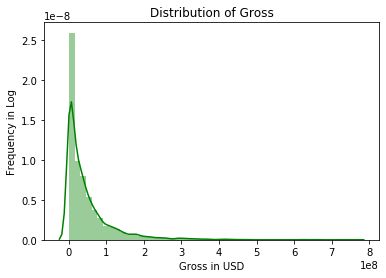
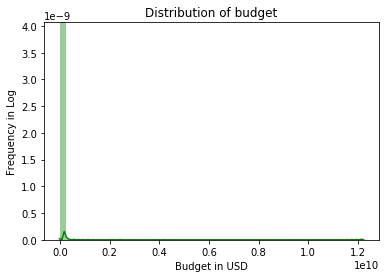
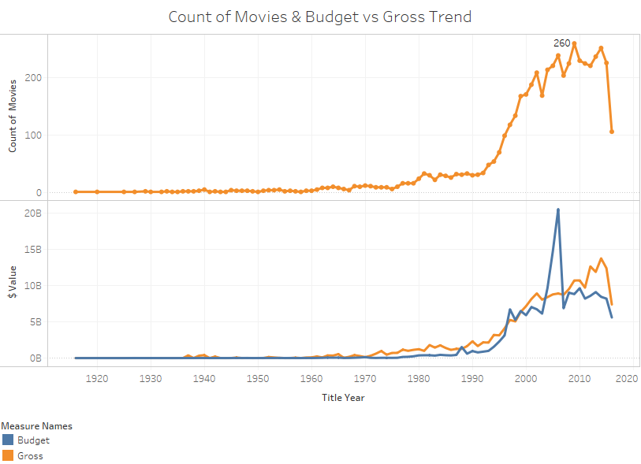
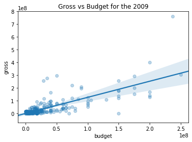
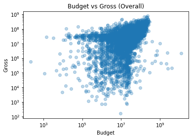
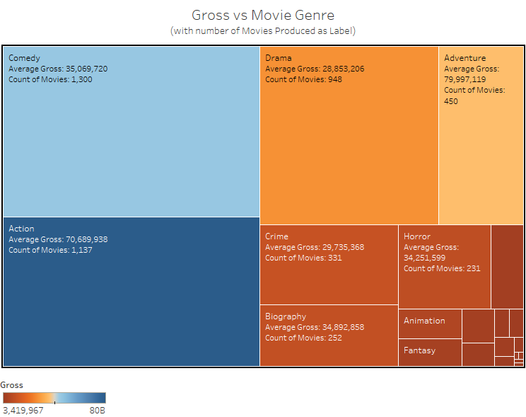
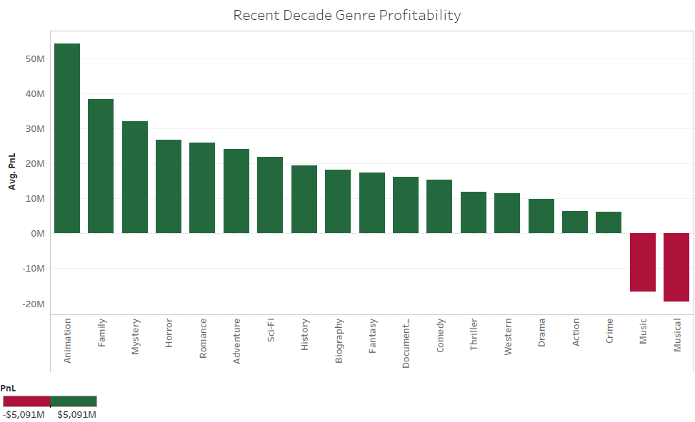
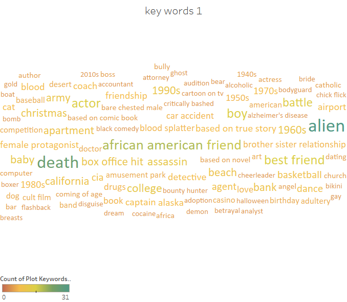
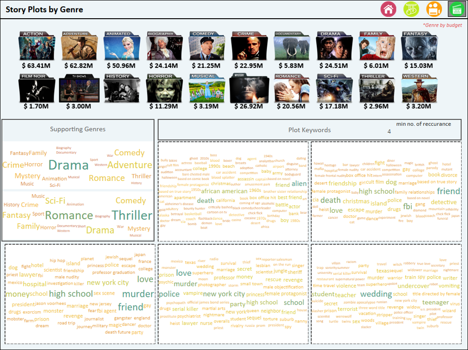

Original work of [Kunal Bhardwaj](https://www.linkedin.com/in/kunal-bharadwaj-928417122) & [Veera Vignesh](https://www.linkedin.com/in/veeravignesh1)

## Introduction

Movies have been a part of our culture for a long time now. It all started with the plays which dates back to 5th century BC. Short films which where projected during 1890's is considered as the breakthrough in film industry. 20th century can be said as a catalyst for the growth of the industry where the movies and the technologies used evolved. Industry has been through many faces such as 

- Silent Era

- Rise of Hollywood

- Golden Era

- Appearances of Blockbusters

- Modern film industry

Now the industry has matured and has turned into a $ 40 Billion dollar industry with USA being the third largest behind China and India in terms of tickets sold.

**USA** has housed world famous production houses namely Warner Bros, Sony Motion Pictures, Walt Disney, Universal Pictures to name a few.

## Problem Statement

Movies made by the production houses primarily aims at making there movies Likeable and Profitable. Suppose production houses are interested in answering the following question

**What are the factors to be considered to make a successful movie?**

## Objective

- To analyze the factors affecting the success of the movie like gross, Facebook likes, critic reviews, Imdb Score etc.
- To recommend suitable director, cast, plot based on the chosen genre to make our movie profitable

## Data

- To analyze the mentioned problem [IMDB-5000-Movie-Dataset](https://data.world/popculture/imdb-5000-movie-dataset) was obtained from [data.world](https://data.world)
- Our data consist of 5048 movies from the year 1916 to 2016
- Each observation represents the individual movie produced with various fields such as title, year, director, cast etc. with the total of **5048 rows and 28 columns**.

## Feature engineering 

- Genre column contains multiple values delimited with pipe operator ( ' | ' ) excel was used to make them into individual columns. Top 3 Genres are only considered and named as genre_1, genre_2, genre_3. Now our data set contains 5048 rows and 30 columns

  These modifications where done using **excel** . After initial modifications the data is loaded onto python using pandas for further analysis

## Exploratory Data Analysis

```python
# importing necessary modules
import pandas as pd
import numpy as np
import matplotlib.pyplot as plt
import seaborn as sns
import os
import statsmodels.api as stm
```

```python
# Loading the data into the dataframe

df = pd.read_csv('movie_metadata.csv')

# Displaying 5 samples of the dataset
df.sample(5)
```


<table border="1" class="dataframe">
  <thead>
    <tr style="text-align: right;">
      <th></th>
      <th>color</th>
      <th>director_name</th>
      <th>num_critic_for_reviews</th>
      <th>duration</th>
      <th>director_facebook_likes</th>
      <th>actor_3_facebook_likes</th>
      <th>actor_2_name</th>
      <th>actor_1_facebook_likes</th>
      <th>gross</th>
      <th>genres</th>
      <th>...</th>
      <th>num_user_for_reviews</th>
      <th>language</th>
      <th>country</th>
      <th>content_rating</th>
      <th>budget</th>
      <th>title_year</th>
      <th>actor_2_facebook_likes</th>
      <th>imdb_score</th>
      <th>aspect_ratio</th>
      <th>movie_facebook_likes</th>
    </tr>
  </thead>
  <tbody>
    <tr>
      <th>2977</th>
      <td>Color</td>
      <td>Darnell Martin</td>
      <td>81.0</td>
      <td>109.0</td>
      <td>67.0</td>
      <td>192.0</td>
      <td>Veronika Dash</td>
      <td>436.0</td>
      <td>8134217.0</td>
      <td>Biography|Drama|Music</td>
      <td>...</td>
      <td>90.0</td>
      <td>English</td>
      <td>USA</td>
      <td>R</td>
      <td>12000000.0</td>
      <td>2008.0</td>
      <td>223.0</td>
      <td>7.0</td>
      <td>2.35</td>
      <td>0</td>
    </tr>
    <tr>
      <th>146</th>
      <td>Color</td>
      <td>Rob Minkoff</td>
      <td>196.0</td>
      <td>92.0</td>
      <td>50.0</td>
      <td>517.0</td>
      <td>Zach Callison</td>
      <td>3000.0</td>
      <td>111505642.0</td>
      <td>Adventure|Animation|Comedy|Family|Sci-Fi</td>
      <td>...</td>
      <td>130.0</td>
      <td>English</td>
      <td>USA</td>
      <td>PG</td>
      <td>145000000.0</td>
      <td>2014.0</td>
      <td>1000.0</td>
      <td>6.9</td>
      <td>1.85</td>
      <td>11000</td>
    </tr>
    <tr>
      <th>3482</th>
      <td>Color</td>
      <td>Michael Anderson</td>
      <td>112.0</td>
      <td>119.0</td>
      <td>23.0</td>
      <td>440.0</td>
      <td>Jenny Agutter</td>
      <td>1000.0</td>
      <td>25000000.0</td>
      <td>Action|Adventure|Sci-Fi</td>
      <td>...</td>
      <td>242.0</td>
      <td>English</td>
      <td>USA</td>
      <td>PG</td>
      <td>9000000.0</td>
      <td>1976.0</td>
      <td>659.0</td>
      <td>6.8</td>
      <td>2.35</td>
      <td>0</td>
    </tr>
    <tr>
      <th>4528</th>
      <td>Color</td>
      <td>Shimit Amin</td>
      <td>14.0</td>
      <td>150.0</td>
      <td>6.0</td>
      <td>20.0</td>
      <td>Shazahn Padamsee</td>
      <td>964.0</td>
      <td>NaN</td>
      <td>Comedy|Drama</td>
      <td>...</td>
      <td>35.0</td>
      <td>Hindi</td>
      <td>India</td>
      <td>NaN</td>
      <td>NaN</td>
      <td>2009.0</td>
      <td>22.0</td>
      <td>7.5</td>
      <td>NaN</td>
      <td>773</td>
    </tr>
    <tr>
      <th>197</th>
      <td>Color</td>
      <td>M. Night Shyamalan</td>
      <td>349.0</td>
      <td>100.0</td>
      <td>0.0</td>
      <td>894.0</td>
      <td>Zoë Kravitz</td>
      <td>10000.0</td>
      <td>60522097.0</td>
      <td>Action|Adventure|Sci-Fi</td>
      <td>...</td>
      <td>744.0</td>
      <td>English</td>
      <td>USA</td>
      <td>PG-13</td>
      <td>130000000.0</td>
      <td>2013.0</td>
      <td>943.0</td>
      <td>4.9</td>
      <td>2.35</td>
      <td>37000</td>
    </tr>
  </tbody>
</table>
<p>5 rows × 28 columns</p>
The Output of the describe() function is

<table border="1" class="dataframe">
  <thead>
    <tr style="text-align: right;">
      <th></th>
      <th>num_critic_for_reviews</th>
      <th>duration</th>
      <th>director_facebook_likes</th>
      <th>actor_3_facebook_likes</th>
      <th>actor_1_facebook_likes</th>
      <th>gross</th>
      <th>num_voted_users</th>
      <th>cast_total_facebook_likes</th>
      <th>facenumber_in_poster</th>
      <th>num_user_for_reviews</th>
      <th>budget</th>
      <th>title_year</th>
      <th>actor_2_facebook_likes</th>
      <th>imdb_score</th>
      <th>aspect_ratio</th>
      <th>movie_facebook_likes</th>
    </tr>
  </thead>
  <tbody>
    <tr>
      <th>count</th>
      <td>4993.000000</td>
      <td>5028.000000</td>
      <td>4939.000000</td>
      <td>5020.000000</td>
      <td>5036.000000</td>
      <td>4.159000e+03</td>
      <td>5.043000e+03</td>
      <td>5043.000000</td>
      <td>5030.000000</td>
      <td>5022.000000</td>
      <td>4.551000e+03</td>
      <td>4935.000000</td>
      <td>5030.000000</td>
      <td>5043.000000</td>
      <td>4714.000000</td>
      <td>5043.000000</td>
    </tr>
    <tr>
      <th>mean</th>
      <td>140.194272</td>
      <td>107.201074</td>
      <td>686.509212</td>
      <td>645.009761</td>
      <td>6560.047061</td>
      <td>4.846841e+07</td>
      <td>8.366816e+04</td>
      <td>9699.063851</td>
      <td>1.371173</td>
      <td>272.770808</td>
      <td>3.975262e+07</td>
      <td>2002.470517</td>
      <td>1651.754473</td>
      <td>6.442138</td>
      <td>2.220403</td>
      <td>7525.964505</td>
    </tr>
    <tr>
      <th>std</th>
      <td>121.601675</td>
      <td>25.197441</td>
      <td>2813.328607</td>
      <td>1665.041728</td>
      <td>15020.759120</td>
      <td>6.845299e+07</td>
      <td>1.384853e+05</td>
      <td>18163.799124</td>
      <td>2.013576</td>
      <td>377.982886</td>
      <td>2.061149e+08</td>
      <td>12.474599</td>
      <td>4042.438863</td>
      <td>1.125116</td>
      <td>1.385113</td>
      <td>19320.445110</td>
    </tr>
    <tr>
      <th>min</th>
      <td>1.000000</td>
      <td>7.000000</td>
      <td>0.000000</td>
      <td>0.000000</td>
      <td>0.000000</td>
      <td>1.620000e+02</td>
      <td>5.000000e+00</td>
      <td>0.000000</td>
      <td>0.000000</td>
      <td>1.000000</td>
      <td>2.180000e+02</td>
      <td>1916.000000</td>
      <td>0.000000</td>
      <td>1.600000</td>
      <td>1.180000</td>
      <td>0.000000</td>
    </tr>
    <tr>
      <th>25%</th>
      <td>50.000000</td>
      <td>93.000000</td>
      <td>7.000000</td>
      <td>133.000000</td>
      <td>614.000000</td>
      <td>5.340988e+06</td>
      <td>8.593500e+03</td>
      <td>1411.000000</td>
      <td>0.000000</td>
      <td>65.000000</td>
      <td>6.000000e+06</td>
      <td>1999.000000</td>
      <td>281.000000</td>
      <td>5.800000</td>
      <td>1.850000</td>
      <td>0.000000</td>
    </tr>
    <tr>
      <th>50%</th>
      <td>110.000000</td>
      <td>103.000000</td>
      <td>49.000000</td>
      <td>371.500000</td>
      <td>988.000000</td>
      <td>2.551750e+07</td>
      <td>3.435900e+04</td>
      <td>3090.000000</td>
      <td>1.000000</td>
      <td>156.000000</td>
      <td>2.000000e+07</td>
      <td>2005.000000</td>
      <td>595.000000</td>
      <td>6.600000</td>
      <td>2.350000</td>
      <td>166.000000</td>
    </tr>
    <tr>
      <th>75%</th>
      <td>195.000000</td>
      <td>118.000000</td>
      <td>194.500000</td>
      <td>636.000000</td>
      <td>11000.000000</td>
      <td>6.230944e+07</td>
      <td>9.630900e+04</td>
      <td>13756.500000</td>
      <td>2.000000</td>
      <td>326.000000</td>
      <td>4.500000e+07</td>
      <td>2011.000000</td>
      <td>918.000000</td>
      <td>7.200000</td>
      <td>2.350000</td>
      <td>3000.000000</td>
    </tr>
    <tr>
      <th>max</th>
      <td>813.000000</td>
      <td>511.000000</td>
      <td>23000.000000</td>
      <td>23000.000000</td>
      <td>640000.000000</td>
      <td>7.605058e+08</td>
      <td>1.689764e+06</td>
      <td>656730.000000</td>
      <td>43.000000</td>
      <td>5060.000000</td>
      <td>1.221550e+10</td>
      <td>2016.000000</td>
      <td>137000.000000</td>
      <td>9.500000</td>
      <td>16.000000</td>
      <td>349000.000000</td>
    </tr>
  </tbody>
</table>

```python
#To understand about the missing values in the data

df.info()
```

```
<class 'pandas.core.frame.DataFrame'>
RangeIndex: 5043 entries, 0 to 5042
Data columns (total 28 columns):
color                        5024 non-null object
director_name                4939 non-null object
num_critic_for_reviews       4993 non-null float64
duration                     5028 non-null float64
director_facebook_likes      4939 non-null float64
actor_3_facebook_likes       5020 non-null float64
actor_2_name                 5030 non-null object
actor_1_facebook_likes       5036 non-null float64
gross                        4159 non-null float64
genres                       5043 non-null object
actor_1_name                 5036 non-null object
movie_title                  5043 non-null object
num_voted_users              5043 non-null int64
cast_total_facebook_likes    5043 non-null int64
actor_3_name                 5020 non-null object
facenumber_in_poster         5030 non-null float64
plot_keywords                4890 non-null object
movie_imdb_link              5043 non-null object
num_user_for_reviews         5022 non-null float64
language                     5031 non-null object
country                      5038 non-null object
content_rating               4740 non-null object
budget                       4551 non-null float64
title_year                   4935 non-null float64
actor_2_facebook_likes       5030 non-null float64
imdb_score                   5043 non-null float64
aspect_ratio                 4714 non-null float64
movie_facebook_likes         5043 non-null int64
dtypes: float64(13), int64(3), object(12)
memory usage: 1.1+ MB
```

```python
# To better understand the count of the missing values
df.isnull().sum().sort_values(ascending=False)
```

```
gross                        884
budget                       492
aspect_ratio                 329
content_rating               303
plot_keywords                153
title_year                   108
director_name                104
director_facebook_likes      104
num_critic_for_reviews        50
actor_3_name                  23
actor_3_facebook_likes        23
num_user_for_reviews          21
color                         19
duration                      15
facenumber_in_poster          13
actor_2_name                  13
actor_2_facebook_likes        13
language                      12
actor_1_name                   7
actor_1_facebook_likes         7
country                        5
movie_facebook_likes           0
genres                         0
movie_title                    0
num_voted_users                0
movie_imdb_link                0
imdb_score                     0
cast_total_facebook_likes      0
dtype: int64
```

Since Gross and Budget are important fields with many missing values.. Lets look into the distribution of it

```python
# Distribution of the Gross
sns.distplot(df.loc[df.gross.isna()==False,'gross'],color='g')
plt.title('Distribution of Gross')
plt.xlabel('Gross in USD')
plt.ylabel('Frequency in Log')
plt.show()
print(f'Mean: {df.gross.mean():.2f}')
print(f'Median: {df.gross.median():.2f}')
```



```
Mean: 48468407.53
Median: 25517500.00
```

```python
# Distribution of the Budget
sns.distplot(df.loc[df.budget.isna()==False,'budget'],color='g')
plt.title('Distribution of budget')
plt.xlabel('Budget in USD')
plt.ylabel('Frequency in Log')
plt.show()
print(f'Mean: {df.budget.mean():.2f}')
print(f'Median: {df.budget.median():.2f}')
```



```
Mean: 39752620.44
Median: 20000000.00
```

- It is clear that both the distribution are highly skewed to the right and imputing median will be a better approach.
- Since the data spans over a period of 100 years imputing values with the median of the entire series will be wrong as the money value changes over time.

**Imputing with the median of the corresponding year will be a better approach**

```python
# Grouping by title_year and imputing gross and budget with median.
df.loc[df.gross.isnull(), 'gross'] = df.groupby('title_year')['gross'].transform('median')
df.loc[df.budget.isnull(), 'budget'] = df.groupby('title_year')['budget'].transform('median')
```

```python
df.isnull().sum()
```

```
color                         19
director_name                104
num_critic_for_reviews        50
duration                      15
director_facebook_likes      104
actor_3_facebook_likes        23
actor_2_name                  13
actor_1_facebook_likes         7
gross                        130
genres                         0
actor_1_name                   7
movie_title                    0
num_voted_users                0
cast_total_facebook_likes      0
actor_3_name                  23
facenumber_in_poster          13
plot_keywords                153
movie_imdb_link                0
num_user_for_reviews          21
language                      12
country                        5
content_rating               303
budget                       100
title_year                   108
actor_2_facebook_likes        13
imdb_score                     0
aspect_ratio                 329
movie_facebook_likes           0
dtype: int64
```

```python
# Dropping values with both gross and budget that is not available

df.drop(df.index[(df.gross.isna() == True) & 
    (df.budget.isna() == True)], inplace=True)
```

```python
df.shape
```

```
(4946, 28)
```

```python
df.isnull().sum().sort_values(ascending=False)
```

```
aspect_ratio                 309
content_rating               264
plot_keywords                140
num_critic_for_reviews        42
gross                         33
actor_3_facebook_likes        19
actor_3_name                  19
num_user_for_reviews          15
color                         15
facenumber_in_poster          13
duration                      12
actor_2_name                  11
title_year                    11
director_facebook_likes       11
actor_2_facebook_likes        11
director_name                 11
language                       9
actor_1_name                   7
actor_1_facebook_likes         7
budget                         3
country                        1
movie_facebook_likes           0
genres                         0
movie_title                    0
num_voted_users                0
movie_imdb_link                0
imdb_score                     0
cast_total_facebook_likes      0
dtype: int64
```

Dropping these 97 observation actually reduced the number of null values in director_name and director_facebook_likes. Since the number of Null Values is within 1% of the total observation for prime factors we can proceed with our analysis

### Hypothesis 1 : Is Gross of the movie related to budget ?

Let us first understand the overall trend of the budget vs gross for all the years.



1970s is rightly called as the golden of industry as we can see the number of movies that where produced exploded and the budget involved in movie production also increased drastically.

Now lets drill down into this.. Lets take our hypothesis on the year in which maximum number of movies where produced and later generalize it over all the years

```python
print(f"In the year {df.groupby('title_year')['gross'].count().idxmax()}",end='')
print(f" there were about {df.groupby('title_year')['gross'].count().max()} movies released, which maximum as per our data")
```

```
In the year 2009.0 there were about 260 movies released, which maximum as per our data
```

```python
# Plotting regplot for 2009
sns.regplot(df.loc[df.title_year==2009,'budget'],df.loc[df.title_year==2009,'gross'],scatter_kws={'alpha':0.3})
plt.title('Gross vs Budget for the 2009')
plt.show()
```



We can observe that there is linear relationship between the gross and the budget. This is only for the year with maximum number of movies of that year. 

```python
# Understanding the plot of all the movies over the years
plt.scatter(df.budget,df.gross,alpha=0.3)
plt.xscale('log')
plt.yscale('log')
plt.show()
```



From the above graph it is clear that our hypothesis holds because we can see a linear relationship between the Budget and the Gross.

### Hypothesis 2: Best genre to make successful movie in the current era?

Before getting into current era lets explore the best movie genre of all time by plotting the highest gross movies and understanding the number of movies in individual genre.



The size of the tree represents the number of movies released in that particular genre and the color of the genre represents the Average gross of that particular genre.

From this we are able to interpret that even though the number of movies produced in the animation genre is less the gross obtained from it is about 80 M. 
Adventure contains a considerably large number of movies and the gross obtained on average is also \$80 M

Now lets explore the trend of the current decade 2010-2016



From the graph it is clear that the average gross from the **animation and family** is higher and the number of movies released in the genre are less our production company can use this opportunity and capitalize on it.

### Hypothesis 3: Common Plots of successful movies?

For this the  field plot_keywords to arrive at the keywords which occur more often in the profitable movies of the particular genre. Based on the keywords frequency we can make a plot out of it.



Pipe operator separated plot_keywords where separated into individual fields. For all the profitable movies in that particular genre keywords where filtered out to make the Tableau dashboard



The entire analysis was then converted to Tableau Dashboard which will improve the usability of the report.

[Movie Dashboard](https://public.tableau.com/views/MovieAnalysis_15709753412350/Landingpage?:embed=y&:display_count=yes&:origin=viz_share_link)


<br>


<br>

## Future Work

- Using a time series model to predict the expected the average gross for the given budget.
- Exploring other factors that also influence the success of the movie which will give better insights to the production house

##  References

1. [Statista](https://www.statista.com/statistics/237749/value-of-the-global-entertainment-and-media-market/)
2. [History of Film](https://en.wikipedia.org/wiki/History_of_film)
3. [Box office](https://en.wikipedia.org/wiki/Box_office)
